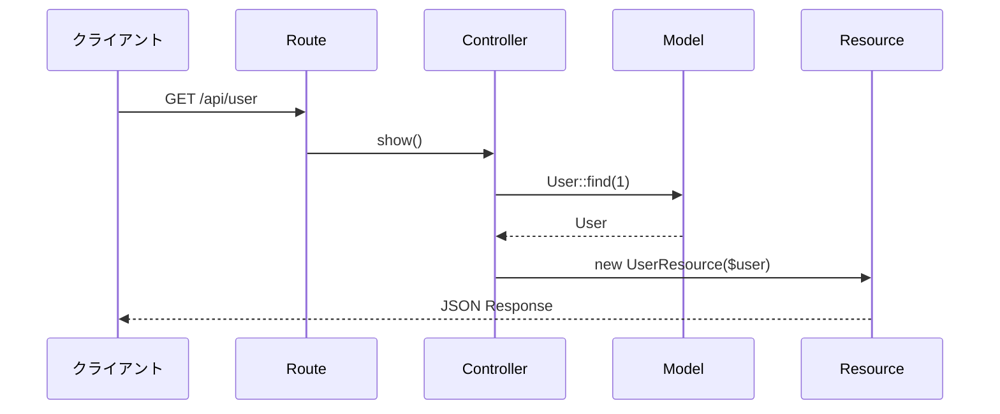

# Lesson 1: はじめてのAPI実装

## 学習目標

このレッスンでは、LaravelでシンプルなAPIエンドポイントを作成し、API Resourceを使ったレスポンス整形の基本を理解します。
手順に沿って実装し、完了したコードと練習問題の回答を含めたプルリクエストを作成しましょう。

### 到達目標
- `/api/user` エンドポイントを作成できる
- `UserController` でユーザー情報を取得して返せる
- `UserResource` を使ってレスポンス形式を整えられる

## Step 1: APIルーティングの作成

まず、このレッスンで実装するAPIの全体像を確認しましょう。



### ルートの定義

`routes/api.php` を開き、以下のルートを追加します。

```php
<?php

use Illuminate\Support\Facades\Route;
use App\Http\Controllers\Api\UserController;

Route::get('/user', [UserController::class, 'show']);
```

**ポイント**
- APIルートは自動的に `/api` プレフィックスが付きます
- つまり、実際のURLは `/api/user` になります

次のコマンドでルーティングが追加されているか、確認してください。

```bash
php artisan route:list --path=api/user
```

## Step 2: コントローラーの作成

### artisan コマンドでコントローラーを生成

```bash
php artisan make:controller Api/UserController
```

`app/Http/Controllers/Api/UserController.php` が作成されます。

### コントローラーの実装

```php
<?php

namespace App\Http\Controllers\Api;

use App\Http\Controllers\Controller;
use App\Models\User;

class UserController extends Controller
{
    public function show()
    {
        // ID=1のユーザーを取得
        $user = User::find(1);

        // ユーザー情報をJSONで返す
        return response()->json($user);
    }
}
```

### 動作確認

ブラウザまたはターミナルで確認してみましょう。

```bash
curl http://localhost:8000/api/user
```

以下のようなレスポンスが返ってくれば成功です。
※ 日時の値はシーダーを実行した時間の値になります。

```json
{
    "id": 1,
    "name": "Test User",
    "email": "test@example.com",
    "email_verified_at": null,
    "created_at": "2025-01-01T00:00:00.000000Z",
    "updated_at": "2025-01-01T00:00:00.000000Z"
}
```

## Step 3: API Resourceの作成

### なぜAPI Resourceを使うのか？

現在のレスポンスには問題があります。

1. `email_verified_at` や `updated_at` など不要な情報が含まれる可能性がある
2. Controller のコードが肥大化する
3. 他のエンドポイントでも同じ形式でユーザー情報を返したい場合、レスポンス形式がバラバラになったり、コードが重複する

**API Resource** を使うと、これらの問題を解決できます。

### API Resourceの生成

```bash
php artisan make:resource UserResource
```

`app/Http/Resources/UserResource.php` が作成されます。

### UserResourceの実装

```php
<?php

namespace App\Http\Resources;

use Illuminate\Http\Request;
use Illuminate\Http\Resources\Json\JsonResource;

class UserResource extends JsonResource
{
    /** @var \App\Models\User */
    public $resource;

    /**
     * Transform the resource into an array.
     *
     * @return array<string, mixed>
     */
    public function toArray(Request $request): array
    {
        return [
            'id' => $this->resource->id,
            'name' => $this->resource->name,
            'email' => $this->resource->email,
            'created_at' => $this->resource->created_at->toISOString(),
        ];
    }
}

```

**ポイント**
- `$this->resource` はUserモデルのインスタンスを指します
- 返したいフィールドだけを指定できます
- 日付のフォーマットも自由に変更できます

### コントローラーの修正

`UserController.php` を修正して、`UserResource` を使うようにします。

```php
<?php

namespace App\Http\Controllers\Api;

use App\Http\Controllers\Controller;
use App\Http\Resources\UserResource;
use App\Models\User;

class UserController extends Controller
{
    public function show()
    {
        // ID=1のユーザーを取得
        $user = User::find(1);

        // ユーザー情報をJSONで返す
        return new UserResource($user);
    }
}
```

### 動作確認

再度APIを呼び出してみましょう。

```bash
curl http://localhost:8000/api/user
```

```json
{
    "data": {
        "id": 1,
        "name": "テストユーザー",
        "email": "test@example.com",
        "created_at": "2025-01-01T00:00:00.000Z"
    }
}
```

**注目ポイント**
- レスポンスが `data` でラップされています（API Resourceのデフォルト動作）
- 指定したフィールドのみが含まれています
- 日付のフォーマットが変わっています

## Step 4: 発展 - パスパラメータでユーザーを指定

現在は ID=1 のユーザーを固定で返していますが、URLで任意のユーザーIDを指定できるようにしましょう。

### ルートの修正

`routes/api.php` を修正します。

```php
Route::get('/user/{id}', [App\Http\Controllers\Api\UserController::class, 'show']);
```

### コントローラーの修正

```php
public function show(int $id): UserResource
{
    $user = User::find($id);
    return new UserResource($user);
}
```

### さらに改善: Route Model Binding

Laravelには「Route Model Binding」という便利な機能があります。これを使うと、IDからモデルの取得を自動化できます。

```php
// ルート（api.php）
Route::get('/user/{user}', [App\Http\Controllers\Api\UserController::class, 'show']);

// コントローラー
public function show(User $user): UserResource
{
    // Laravelが自動的にIDからUserを取得してくれる
    // 見つからない場合は自動で404を返す
    return new UserResource($user);
}
```

これにより、コントローラーのコードがシンプルになります。

## 練習問題

### 問題1
`UserResource` に `full_name` というフィールドを追加してください。このフィールドは `{name}さん` という形式で値を返すようにしてください。

### 問題2
ユーザー一覧を返す `/api/users` エンドポイントを作成してください。

## 参考資料

- [Laravel 公式ドキュメント - Eloquent: API Resources](https://laravel.com/docs/eloquent-resources)
- [Laravel 公式ドキュメント - Routing: Route Model Binding](https://laravel.com/docs/routing#route-model-binding)
- [Laravel 公式ドキュメント - Controllers](https://laravel.com/docs/controllers)

## 次のレッスン
[Lesson 2: デバッグ手法を身につける](./02-debugging.md) では、今回作成したAPIを使ってデバッグ方法を学びます。
