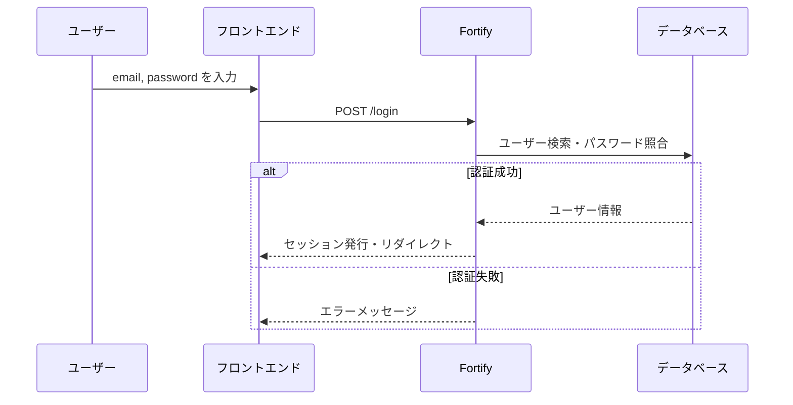

# Lesson 3: 認証の仕組みを理解する

## 学習目標

このレッスンでは、既に導入されているFortifyの仕組みを理解し、認証フローを把握します。
手順に沿って実装し、完了したコードと練習問題の回答を含めたプルリクエストを作成しましょう。

### 到達目標
- Laravel Fortifyの役割を理解する
- 認証の流れ（ログイン/ログアウト）を把握する
- ミドルウェア（`auth`）の動作を理解する
- 認証済みユーザーのみアクセス可能なAPIを作成できる

## 認証とは？

**認証（Authentication）** とは、「このユーザーは本当に本人か？」を確認するプロセスです。

- ログイン時にメールアドレスとパスワードを入力
- システムがパスワードを照合
- 正しければ「認証済み」としてセッションを発行

次のレッスンで学ぶ**認可（Authorization）** とは異なります。

| 概念 | 質問 | 例 |
|------|------|-----|
| 認証 | この人は誰？ | ログイン処理 |
| 認可 | この人は何ができる？ | 管理者のみアクセス可能 |

## Laravel Fortifyとは？

### Fortifyの役割

Laravel Fortify は、認証機能の**バックエンド実装**を提供するパッケージです。

提供する機能
- ログイン / ログアウト
- ユーザー登録
- パスワードリセット
- メール確認
- 2要素認証

**重要**: FortifyはフロントエンドのUIを提供しません。UIは別途実装する必要があります（このプロジェクトではInertia + Reactで実装済み）。

## Step 1: 認証の流れを理解する

### ログインの流れ




## Step 2: authミドルウェアを理解する

### ミドルウェアとは？

ミドルウェアは、リクエストがコントローラーに到達する前に実行される処理です。

```
リクエスト → [ミドルウェア] → コントローラー → レスポンス
```

### authミドルウェア

`auth` ミドルウェアは、認証済みのユーザーのみアクセスを許可します。

未認証の場合
- Webリクエスト → ログイン画面にリダイレクト
- APIリクエスト → 401 Unauthorized エラー

### ルートへの適用

```php
// routes/web.php
Route::get('/dashboard', function () {
    return Inertia::render('dashboard');
})->middleware(['auth', 'verified']);
```

- `auth`: 認証済みユーザーのみ
- `verified`: メール確認済みユーザーのみ

---

## Step 3: 認証が必要なAPIを作成する

### 認証済みユーザーの情報を返すAPI

`routes/api.php` に以下を追加します。

```php
use Illuminate\Support\Facades\Route;

// 認証不要（公開API）
Route::get('/user/{user}', [UserController::class, 'show']);

// 認証必要（要ログイン）
Route::middleware('auth:sanctum')->group(function () {
    Route::get('/me', [App\Http\Controllers\Api\UserController::class, 'me']);
});
```

### コントローラーにメソッドを追加

`app/Http/Controllers/Api/UserController.php`

```php
<?php

namespace App\Http\Controllers\Api;

use App\Http\Controllers\Controller;
use App\Http\Resources\UserResource;
use App\Models\User;
use Illuminate\Http\Request;

class UserController extends Controller
{
    public function show(User $user): UserResource
    {
        return new UserResource($user);
    }

    /**
     * 認証済みユーザー自身の情報を返す
     */
    public function me(Request $request): UserResource
    {
        // $request->user() で認証済みユーザーを取得
        return new UserResource($request->user());
    }
}
```

### 動作確認

**未認証でアクセス**

```bash
curl http://localhost:8000/api/me -H "Accept: application/json"
```

```json
{
    "message": "Unauthenticated."
}
```

401エラーが返ります。

> **注意**: `Accept: application/json` ヘッダーがないと、ログイン画面へリダイレクトされます。APIとして利用する場合は必ずこのヘッダーを付けましょう。

### APIでログイン/ログアウトを試す

curlでログイン/ログアウトの動作を確認してみましょう。

**1. ログイン**

Postmanから「ログインAPI」でリクエストしてみましょう！

**2. 認証済みAPIにアクセス**

Postmanから「ログインAPI」でリクエストしてみましょう！

**3. ログアウト**

Postmanから「ログアウトAPI」でリクエストしてみましょう！

## Step 4: Sanctumについて

### Sanctumとは？

Laravel Sanctumは、API認証のためのパッケージです。

2つの認証方式を提供します。
1. **SPAセッション認証**: 同一ドメインのSPAからのリクエスト
2. **APIトークン認証**: モバイルアプリや外部サービスからのリクエスト

このプロジェクトでは、InertiaがSPAとして動作するため、主にセッション認証を使います。

### auth:sanctum ミドルウェア

```php
Route::middleware('auth:sanctum')->group(function () {
    // このグループ内はSanctumで認証
});
```

このミドルウェアは
- セッション認証（SPA用）
- トークン認証（API用）

の両方に対応しています。


## Guard と Provider

### 概念の理解

Laravelの認証システムは、**Guard** と **Provider** で構成されています。

```
Guard: 認証状態の管理方法を決める
  - session: セッションで認証状態を保持
  - token: トークンで認証

Provider: ユーザー情報の取得方法を決める
  - database: DBから直接取得
  - eloquent: Eloquentモデル経由で取得
```

### 設定ファイル

`config/auth.php` で設定されています。

```php
'guards' => [
    'web' => [
        'driver' => 'session',
        'provider' => 'users',
    ],
],

'providers' => [
    'users' => [
        'driver' => 'eloquent',
        'model' => App\Models\User::class,
    ],
],
```

通常、この設定を変更する必要はありません。

## 練習問題

### 問題1
認証済みユーザーの `name` を更新する `PUT /api/me` エンドポイントを作成してください。

### 問題2
`me` メソッドにログ出力を追加し、認証済みユーザーが自身の情報を取得したことを記録してください。

## 参考資料

- [Laravel 公式ドキュメント - Authentication](https://laravel.com/docs/authentication)
- [Laravel 公式ドキュメント - Fortify](https://laravel.com/docs/fortify)
- [Laravel 公式ドキュメント - Sanctum](https://laravel.com/docs/sanctum)


## 次のレッスン

[Lesson 4: 認可（Gate/Policy）を実装する](./04-authorization.md) では、「誰が何をできるか」を制御する認可機能を学びます。
