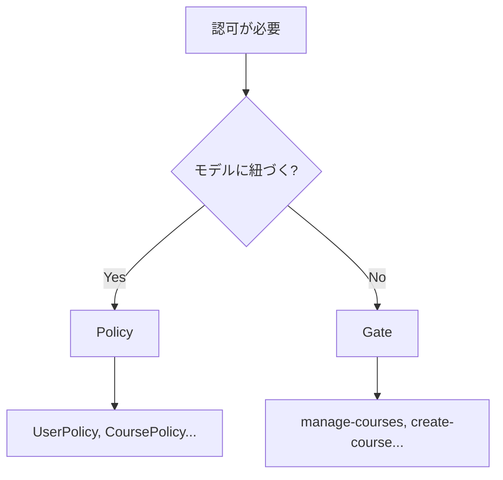

# Lesson 7 認可（Gate/Policy）を実装する

## 学習目標

このレッスンでは、GateとPolicyを使った認可制御を理解し、「誰が何をできるか」を適切に制御できるようになります。

### 到達目標
- 認証と認可の違いを理解する
- Gate を使った認可チェックができる
- Policy を使ったモデルベースの認可ができる
- ユーザーに役割（role）を追加できる


## 認証 vs 認可

| 概念 | 英語 | 質問 | 例 |
|------|------|------|-----|
| 認証 | Authentication | この人は誰？ | ログイン処理 |
| 認可 | Authorization | この人は何ができる？ | 管理者のみ削除可能 |

前回のレッスンで「認証」を学びました。今回は「認可」です。

### なぜ認可が必要か

認証だけでは不十分なケースがあります。

```
シナリオ: ユーザー情報の編集API

❌ 認証のみ
→ ログインしていれば誰でも他人の情報を編集できてしまう

✅ 認証 + 認可
→ ログインしている かつ 自分自身の情報のみ編集可能
```


## Step 1 ユーザーに役割を追加する

このStepでは以下を実装します。
- UserRole Enumを作成
- Userモデルに`role`フィールドのfillable・キャスト・便利メソッドを追加

> `users` テーブルの `role` カラムと、`test@example.com`（student）/`test2@example.com`（instructor）のテストユーザーは、初期マイグレーションと `DatabaseSeeder` で既に用意済みです。追加のマイグレーションは不要です。

### Userモデルの修正

`app/Models/User.php` に `role` を追加します。

```php
protected $fillable = [
    'name',
    'email',
    'password',
    'role',  // 追加
];
```

### 役割の定義（Enum）

PHP 8.1以降では Enum を使うのがベストプラクティスです。

`app/Enums/UserRole.php` を作成します。

```php
<?php

namespace App\Enums;

enum UserRole: string
{
    case Student = 'student';
    case Instructor = 'instructor';

    public function label(): string
    {
        return match($this) {
            self::Student => '生徒',
            self::Instructor => '講師',
        };
    }
}
```

### Userモデルでのキャスト

```php
use App\Enums\UserRole;

protected function casts(): array
{
    return [
        'email_verified_at' => 'datetime',
        'password' => 'hashed',
        'role' => UserRole::class,  // 追加
    ];
}

// 便利メソッドを追加
public function isInstructor(): bool
{
    return $this->role === UserRole::Instructor;
}

public function isStudent(): bool
{
    return $this->role === UserRole::Student;
}
```

### UserFactory に role の state を追加

テストで「生徒のユーザー」「講師のユーザー」を作れるように、`database/factories/UserFactory.php` に state を追加します。Lesson 17 以降のテストで多用するので、ここで用意しておきます。

```php
use App\Enums\UserRole;

/**
 * 生徒ロールのユーザー
 */
public function student(): static
{
    return $this->state(fn (array $attributes) => [
        'role' => UserRole::Student,
    ]);
}

/**
 * 講師ロールのユーザー
 */
public function instructor(): static
{
    return $this->state(fn (array $attributes) => [
        'role' => UserRole::Instructor,
    ]);
}
```

> state は「このFactoryで作るモデルの、ある決まったバリエーション」を名前付きで定義する仕組みです。以降 `User::factory()->instructor()->create()` と書けば、講師ロールのユーザーが1件作られます。


## Step 2 Policyを使った認可

このStepでは以下を実装します。
- UserPolicyを作成
- 認可メソッド（view, update, delete等）を実装

### Policyとは

Policy は、特定のモデルに対する認可ルールをまとめたクラスです。「このユーザーを編集できるか」のようなモデルに紐づくアクションを扱います。

> Laravelには Policy のほかに `Gate` という仕組みもあり、モデルに紐づかない汎用アクション（例: 「管理画面にアクセスできるか」）に使われます。本コースでは Policy を採用します。Gate の使い方はレッスン末尾の「参考」節を参照してください。

### Policyの作成

`make app` でコンテナに入ってから、以下のコマンドを実行します。

```bash
php artisan make:policy UserPolicy --model=User
```

`app/Policies/UserPolicy.php` が作成されます。

### Policyの実装

```php
<?php

namespace App\Policies;

use App\Models\User;

class UserPolicy
{
    /**
     * ユーザー一覧を閲覧できるか
     */
    public function viewAny(User $user): bool
    {
        // 講師のみ全ユーザーを閲覧可能
        return $user->isInstructor();
    }

    /**
     * 特定のユーザーを閲覧できるか
     */
    public function view(User $user, User $model): bool
    {
        // 自分自身 または 講師なら閲覧可能
        return $user->id === $model->id || $user->isInstructor();
    }

    /**
     * ユーザーを作成できるか
     */
    public function create(User $user): bool
    {
        // 講師のみ作成可能
        return $user->isInstructor();
    }

    /**
     * ユーザーを更新できるか
     */
    public function update(User $user, User $model): bool
    {
        // 自分自身のみ更新可能
        return $user->id === $model->id;
    }

    /**
     * ユーザーを削除できるか
     */
    public function delete(User $user, User $model): bool
    {
        // 誰も削除できない（または管理者のみ）
        return false;
    }
}
```

### Policyの登録

Laravel 11以降（本プロジェクトは Laravel 13）では、モデル名と一致するPolicyは自動的に登録されます。

- `User` モデル → `UserPolicy` が自動的に紐づく

手動で登録する場合は `AppServiceProvider` で設定します。

```php
use App\Models\User;
use App\Policies\UserPolicy;
use Illuminate\Support\Facades\Gate;

public function boot(): void
{
    Gate::policy(User::class, UserPolicy::class);
}
```


## Step 3 Policyをコントローラーで使う（使い方の解説）

このStepでは、Policy を Controller から呼び出す方法を解説します。実際にコードを書くのは Step 4 です（ここでは見方を押さえるだけでOK）。

### authorize メソッド

```php
// 例: show で view を、update で update を呼び出す
public function show(User $user)
{
    $this->authorize('view', $user);    // UserPolicy@view
    return new UserResource($user);
}

public function update(Request $request, User $user)
{
    $this->authorize('update', $user);  // UserPolicy@update
    $user->update($request->validated());
    return new UserResource($user);
}
```

### 認可失敗時のレスポンス

認可に失敗すると、LaravelはHTTP 403エラーを返します。

```json
{
    "message": "This action is unauthorized."
}
```

本コースは既定メッセージのまま進めます。メッセージをカスタマイズする方法はレッスン末尾の「参考」節を参照してください。


## Step 4 実践例 - ユーザー編集APIの保護

ここが本レッスンの「手を動かす」メインパートです。以下を行います。

- ルート: `PATCH /api/users/{user}` を `auth:sanctum` ミドルウェアグループに移動
- Controller: 既存の `UserController@update`（Lesson 5 で作成済み）の先頭に `$this->authorize('update', $user)` を1行追加

### ルートの変更

`routes/api.php` — 既存の `/users` / `/users/{user}`（GET）は公開のまま。`PATCH /users/{user}` のみ `auth:sanctum` グループ内に移動します。

```php
// 公開API
Route::get('/users', [UserController::class, 'index']);
Route::get('/users/{user}', [UserController::class, 'show']);

// 認証必要
Route::middleware('auth:sanctum')->group(function () {
    Route::get('/me', [UserController::class, 'me']);
    Route::patch('/me', [UserController::class, 'updateMe']);
    Route::patch('/users/{user}', [UserController::class, 'update']); // 移動
});
```

### Controllerの修正

既存の `UserController@update` に `$this->authorize('update', $user);` の1行だけ追加します。メソッド全体を置き換える必要はありません。

```php
public function update(UpdateRequest $request, User $user): UserResource
{
    $this->authorize('update', $user);  // ← 追加

    $user->update($request->validated());

    return new UserResource($user);
}
```

### 動作確認

先に `login > ログイン` を実行してセッションを発行してから、Postmanのコレクション内の `api > users > {userId} > users_id`（PATCH）で確認してください。

> 設定箇所
> - `Params > Path Variables` の `userId` を対象ユーザーのIDに書き換える
> - `Body > raw (JSON)` には更新用サンプルJSON（`name`, `email`）が事前設定済み。必要に応じて編集してください

- `userId` を自分のIDに設定して送信 → 成功（200）
- `userId` を別のユーザーのIDに設定して送信 → 失敗（403）


## 練習問題

> 動作確認用に Postman コレクションへ以下のリクエストを用意しています。
> - 問題1: `api > users > {userId} > 役割変更`（PATCH `/api/users/:userId/role`、Body に `{"role":"instructor"}` 事前設定）

### 問題1
UserPolicyに `updateRole` メソッドを追加し、「講師のみ生徒の役割を変更できる」という認可を実装してください。また、`PATCH /api/users/{user}/role` エンドポイントを追加して動作確認してください。

<details>
<summary>解答例</summary>

UserPolicy

```php
public function updateRole(User $user, User $model): bool
{
    // 講師のみが生徒の役割を変更できる
    return $user->isInstructor() && $model->isStudent();
}
```

UserController

```php
use App\Enums\UserRole;
use Illuminate\Validation\Rule;

public function updateRole(Request $request, User $user): UserResource
{
    $this->authorize('updateRole', $user);

    $validated = $request->validate([
        'role' => ['required', Rule::enum(UserRole::class)],
    ]);

    $user->update($validated);

    return new UserResource($user);
}
```

ルート（`auth:sanctum` グループ内に追加）

```php
Route::patch('/users/{user}/role', [UserController::class, 'updateRole']);
```
</details>

## 参考

本コースでは実装しませんが、知識として押さえておきたい関連トピックです。

### Gate を使った認可

Gate は、特定のモデルに紐づかない汎用的なアクションの認可に使います。

#### GateとPolicyの使い分け



#### Gateの定義

`app/Providers/AppServiceProvider.php` の `boot` メソッドに追加します。

```php
use Illuminate\Support\Facades\Gate;

public function boot(): void
{
    // 講師のみアクセス可能なアクション
    Gate::define('manage-courses', function ($user) {
        return $user->isInstructor();
    });

    // 自分自身の情報のみアクセス可能
    Gate::define('access-own-data', function ($user, $targetUser) {
        return $user->id === $targetUser->id;
    });
}
```

#### Gateの使用

```php
use Illuminate\Support\Facades\Gate;

// Controllerで使う（失敗時は403エラー）
Gate::authorize('manage-courses');

// 条件分岐で使う
if (Gate::allows('manage-courses')) {
    // 認可OK
}

if (Gate::denies('manage-courses')) {
    // 認可NG
}

// パラメータ付き
Gate::authorize('access-own-data', $targetUser);
```

### 認可エラーのカスタムメッセージ

Policyでカスタムレスポンスを返せます。

```php
use Illuminate\Auth\Access\Response;

public function update(User $user, User $model): Response
{
    if ($user->id === $model->id) {
        return Response::allow();
    }

    return Response::deny('他のユーザーの情報は編集できません。');
}
```


## 参考資料

- [Laravel 公式ドキュメント - Authorization](https://laravel.com/docs/authorization)


## 次のレッスン

[Lesson 8 コレクション](./08-collection.md) では、Eloquentコレクションとコレクションメソッドを学び、データ操作の幅を広げます。
