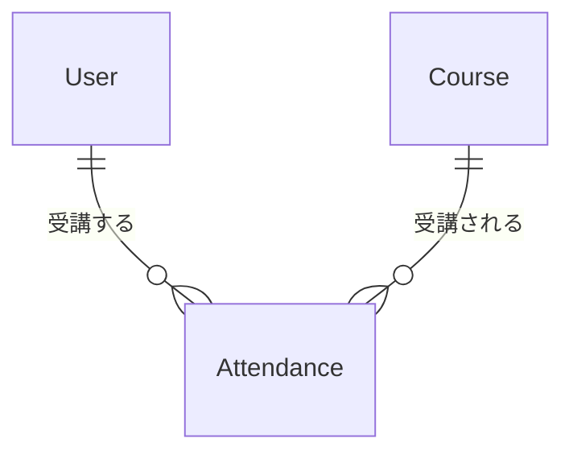

# Lesson 11 データベース設計の基礎

## 学習目標

このレッスンでは、堅牢なデータベース設計の原則を理解し、適切なマイグレーションを書けるようになります。

### 到達目標
- 外部キー制約を正しく設定できる
- インデックスの役割と追加タイミングを理解する
- NULL許可のデメリットを理解し適切に設計できる
- attendances（受講）テーブルを設計できる

> このレッスンは2部構成です。
> - 第1部（Step 1〜5）: DB設計の原則を学ぶ座学パート。サンプルコードには `phone` / `nickname` など仮の題材が含まれます
> - 第2部（Step 6〜9）: 第1部で学んだ原則を使って attendances テーブル・受講登録APIを実装するハンズオンパート

## データベース設計の重要性

データベースはアプリケーションの土台です。

設計を間違えると、データの整合性が崩れたり、パフォーマンスが悪化したり、後からの修正が困難になります。

---

# 第1部 DB設計の原則（座学）

ここからは理論の解説です。サンプルコードは `phone` / `nickname` などプロジェクトにない仮の題材を含みます。プロジェクトへの適用は第2部で行います。

## Step 1 外部キー制約

### 外部キー制約とは

外部キー制約は、テーブル間の参照整合性を保証する仕組みです。

```php
$table->foreignIdFor(User::class)->constrained();
```

これにより、`user_id` に存在しないユーザーIDを入れようとするとエラーになり、データの整合性が保証されます。

### onDelete オプション

参照先が削除された時の動作を指定します。

```php
// CASCADE: 親が削除されたら子も削除
$table->foreignIdFor(User::class)
    ->constrained()
    ->onDelete('cascade');

// SET NULL: 親が削除されたらNULLに
$table->foreignIdFor(User::class, 'instructor_id')
    ->nullable()
    ->constrained('users')
    ->onDelete('set null');

// RESTRICT: 子がいる場合は削除を拒否（デフォルト）
$table->foreignIdFor(Category::class)
    ->constrained()
    ->onDelete('restrict');
```

### 使い分けの指針

| オプション | 用途例 |
|-----------|--------|
| cascade | 親が消えたら子も不要（受講情報、コメントなど） |
| set null | 参照は消えるが履歴は残したい（担当者の退職など） |
| restrict | 削除させたくない（カテゴリに商品があれば削除不可） |

## Step 2 インデックス

### インデックスとは

インデックスは、検索を高速化するための索引です。

本の索引をイメージしてください。索引がない場合は本を最初から読んで探す必要がありますが（フルスキャン）、索引があれば該当箇所を特定してジャンプできます。

### インデックスが必要な場面

```php
// WHERE句で頻繁に使うカラム
$table->string('status')->index();

// 検索・ソートに使うカラム
$table->datetime('attended_at')->index();

// 外部キー（自動的にインデックスが作成される）
$table->foreignIdFor(User::class)->constrained();
```

### 複合インデックス

複数カラムを組み合わせた検索に有効です。

```php
// user_id と status の組み合わせで検索することが多い場合
$table->index(['user_id', 'status']);
```

### インデックスのデメリット

インデックスには書き込みが遅くなる（INSERT/UPDATE時にインデックスも更新）、ストレージを消費する（インデックス分の容量が必要）というデメリットがあります。

原則として、検索に使うカラムにのみ追加してください。

## Step 3 NULL許可のデメリット

### NULLとは

`NULL` は「値がない」状態を表します。空文字 `''` とは異なります。

### NULLの問題点

#### 1. 比較が直感的でない

`NULL` は「＝」で比較できず、専用の書き方が必要です。

```sql
-- NULL は等価比較できない
SELECT * FROM users WHERE email = NULL;  -- 結果は常に0件
SELECT * FROM users WHERE email IS NULL; -- これが正しい
```

Eloquent で書くと以下に対応します。SQLを書けるようになる必要はありませんが、「`where('email', null)` ではなく `whereNull('email')` を使う」という対応関係だけ押さえてください。

```php
User::where('email', null)->get(); // 期待通りに動かない
User::whereNull('email')->get();   // これが正しい
```

#### 2. コードが複雑になる

```php
// NULLチェックが必要
if ($user->phone !== null) {
    // 電話番号がある場合の処理
}

// NULLセーフな書き方
$phone = $user->phone ?? 'なし';
```

### NULL vs NOT NULL + デフォルト値

```php
// ❌ NULLを許可
$table->string('nickname')->nullable();

// ✅ NOT NULL + デフォルト値
$table->string('nickname')->default('');

// ❌ NULLを許可
$table->integer('login_count')->nullable();

// ✅ NOT NULL + デフォルト値
$table->integer('login_count')->default(0);
```

### NULLが適切なケース

- 「未設定」と「空」を区別する必要がある
- 外部キーで「関連なし」を表現する

## Step 4 複合ユニーク制約

### 問題（重複登録を防ぐ）

同じユーザーが同じ講座に2回登録することを防ぎたい。

### アプリケーションレベルでの対策

```php
// ❌ 不十分（競合状態で漏れる可能性）
if (Attendance::where('user_id', $userId)->where('course_id', $courseId)->exists()) {
    throw new AlreadyAttendedException();
}
Attendance::create([...]);
```

### データベースレベルでの対策

```php
// ✅ 複合ユニーク制約
$table->unique(['user_id', 'course_id']);
```

これにより、重複挿入時にDBがエラーを返します。

### 例外処理

複合ユニーク制約違反は、Laravel 11 以降で提供される `UniqueConstraintViolationException` でキャッチできます（本プロジェクトは Laravel 13）。DB ドライバ（MySQL / SQLite など）に依存せずに判定できるのが利点です。

```php
use Illuminate\Database\UniqueConstraintViolationException;

try {
    Attendance::create([
        'user_id' => $userId,
        'course_id' => $courseId,
    ]);
} catch (UniqueConstraintViolationException) {
    throw new AlreadyAttendedException();
}
```

> 以前はドライバごとのエラーコード（MySQL なら `1062`）を `QueryException::errorInfo` で判定していましたが、SQLite では別のコードが返るため非可搬でした。`UniqueConstraintViolationException` に寄せるのがおすすめです。

## Step 5 マイグレーションのベストプラクティス

### 1. 小さな単位で作成

```bash
# ✅ 1つの変更 = 1つのマイグレーション
php artisan make:migration add_phone_to_users_table
php artisan make:migration add_index_to_attendances_status

# ❌ 複数の無関係な変更を1つに
php artisan make:migration update_multiple_tables
```

### 2. down() メソッドを実装

```php
public function up(): void
{
    Schema::table('users', function (Blueprint $table) {
        $table->string('phone')->nullable()->after('email');
    });
}

public function down(): void
{
    Schema::table('users', function (Blueprint $table) {
        $table->dropColumn('phone');
    });
}
```

### 3. 本番データがある場合の変更

```php
// NOT NULL カラムを追加する場合
public function up(): void
{
    Schema::table('users', function (Blueprint $table) {
        // 一旦nullable で追加
        $table->string('nickname')->nullable();
    });

    // デフォルト値を設定
    DB::table('users')->whereNull('nickname')->update(['nickname' => '']);

    // NOT NULLに変更
    Schema::table('users', function (Blueprint $table) {
        $table->string('nickname')->nullable(false)->change();
    });
}
```

### 4. 破壊的変更は慎重に

本番環境でのカラム削除・リネームには注意が必要です。

```php
// ❌ いきなり削除
$table->dropColumn('old_column');

// ✅ 段階的に
// 1. 新カラム追加
// 2. データ移行
// 3. アプリケーション更新
// 4. 旧カラム削除
```

---

# 第2部 実践 - attendancesテーブルの設計と受講登録API

ここからは第1部で学んだ原則を実際に適用していきます。attendances（受講）テーブルを作り、最後に受講登録APIで動作確認します。

## Step 6 Attendancesテーブルの設計

### エンティティ分析

受講（Attendance）は、ユーザーと講座の多対多の関係を表します。



1人のユーザーは複数の講座を受講でき、1つの講座には複数の受講者がいます。

### マイグレーションの作成

`make app` でコンテナに入ってから、以下のコマンドを実行します。

```bash
php artisan make:migration create_attendances_table
```

### マイグレーションの実装

以下のコードには第1部で学んだ要素がすべて含まれています。どこが外部キー制約・複合ユニーク制約かを意識しながら実装してください。

```php
<?php

use Illuminate\Database\Migrations\Migration;
use Illuminate\Database\Schema\Blueprint;
use Illuminate\Support\Facades\Schema;
use App\Models\User;
use App\Models\Course;

return new class extends Migration
{
    public function up(): void
    {
        Schema::create('attendances', function (Blueprint $table) {
            $table->id();

            // 外部キー（Step 1: 受講履歴は残したいので restrict）
            $table->foreignIdFor(User::class)
                ->constrained()
                ->onDelete('restrict');

            $table->foreignIdFor(Course::class)
                ->constrained()
                ->onDelete('restrict');

            // 受講状態（Step 3: NOT NULL + デフォルト値）
            $table->string('status')->default('attending');

            // 受講日時（timestamp 型は 2038 年問題があるので datetime を使う）
            $table->datetime('attended_at')->useCurrent();

            // 同上の理由で timestamps() ではなく datetimes() を使う
            $table->datetimes();

            // 複合ユニーク制約（Step 4: 同じ講座に2回登録できない）
            $table->unique(['user_id', 'course_id']);
        });
    }

    public function down(): void
    {
        Schema::dropIfExists('attendances');
    }
};
```

> `restrict` を選ぶ理由 ： 受講履歴は「誰がいつ受けた／修了した」という監査データ的な性質があるため、ユーザーや講座を削除したら紐づく履歴が静かに消えると問題になります。`restrict` にしておくと、受講履歴が残っている限り親レコード（user / course）を削除できず、「履歴があるのに消そうとしている」ことに気付けます。

### マイグレーションの実行

作成したマイグレーションを適用します。

```bash
php artisan migrate
```

> 既存データを保持したまま差分適用するのが `migrate` です。何かおかしくなったら `make fresh` で全テーブル作り直し＋シーダーが走ります。

## Step 7 Attendanceモデルの作成

### モデルの作成

```bash
php artisan make:model Attendance --factory
```

`--factory` を付けると、モデルと同時に `database/factories/AttendanceFactory.php` も生成されます。Lesson 17 以降のテストで使います。

### Attendanceモデルの実装

生成された `app/Models/Attendance.php` を以下の内容に書き換えます。

```php
<?php

namespace App\Models;

use App\Enums\AttendanceStatus;
use Illuminate\Database\Eloquent\Factories\HasFactory;
use Illuminate\Database\Eloquent\Model;
use Illuminate\Database\Eloquent\Relations\BelongsTo;

class Attendance extends Model
{
    use HasFactory;

    protected $fillable = [
        'user_id',
        'course_id',
        'status',
        'attended_at',
    ];

    protected function casts(): array
    {
        return [
            'status' => AttendanceStatus::class,
            'attended_at' => 'datetime',
        ];
    }

    public function user(): BelongsTo
    {
        return $this->belongsTo(User::class);
    }

    public function course(): BelongsTo
    {
        return $this->belongsTo(Course::class);
    }
}
```

### AttendanceStatus Enum

`app/Enums/AttendanceStatus.php` を新規作成します。

```php
<?php

namespace App\Enums;

enum AttendanceStatus: string
{
    case Attending = 'attending';
    case Completed = 'completed';
    case Cancelled = 'cancelled';

    public function label(): string
    {
        return match($this) {
            self::Attending => '受講中',
            self::Completed => '修了',
            self::Cancelled => 'キャンセル',
        };
    }
}
```

### AttendanceFactory の実装

`--factory` で生成された `database/factories/AttendanceFactory.php` を以下の内容にします。

```php
<?php

namespace Database\Factories;

use App\Enums\AttendanceStatus;
use App\Models\Course;
use App\Models\User;
use Illuminate\Database\Eloquent\Factories\Factory;

class AttendanceFactory extends Factory
{
    public function definition(): array
    {
        return [
            'user_id' => User::factory(),
            'course_id' => Course::factory(),
            'status' => AttendanceStatus::Attending,
            'attended_at' => now(),
        ];
    }

    /**
     * キャンセル済みの受講
     */
    public function cancelled(): static
    {
        return $this->state(fn (array $attributes) => [
            'status' => AttendanceStatus::Cancelled,
        ]);
    }
}
```

> `'user_id' => User::factory()` と書いておくと、`user_id` を明示しなかったときに紐づくユーザーも自動で作られます。テストで `Attendance::factory()->create(['course_id' => $course->id])` のように一部だけ指定できるのはこのためです。

### User と Course にリレーションを追加

Lesson 4 / 9 で作成済みの `app/Models/User.php` と `app/Models/Course.php` に、以下のメソッドを**追記**します（既存のメソッドは残したまま末尾に追加）。

```php
// app/Models/User.php に追記
public function attendances(): HasMany
{
    return $this->hasMany(Attendance::class);
}

public function attendedCourses(): BelongsToMany
{
    return $this->belongsToMany(Course::class, 'attendances')
        ->withPivot('status', 'attended_at')
        ->withTimestamps();
}
```

```php
// app/Models/Course.php に追記
public function attendances(): HasMany
{
    return $this->hasMany(Attendance::class);
}

public function students(): BelongsToMany
{
    return $this->belongsToMany(User::class, 'attendances')
        ->withPivot('status', 'attended_at')
        ->withTimestamps();
}

public function hasCapacity(): bool
{
    return $this->attendances()->count() < $this->capacity;
}
```

`HasMany` / `BelongsToMany` の `use` 文も忘れずに追加してください。

> `hasCapacity()` は現在の実装だと毎回 `attendances` を COUNT するため、講座を多数扱うときにN+1問題の温床になります。Lesson 12でこのコードを Eager Loading と `withCount` で改善します。今はひとまずこの形で進めてOK。

## Step 8 既存テーブルへのカラム追加を実践する

ここまで学んだことを使って、`courses` テーブルに「講座開始日時（`starts_at`）」を追加してみましょう。このカラムは後続のレッスン（Lesson 18 / 19）で使います。

### 要件

- 既存の `courses` テーブルに `starts_at`（NOT NULL）を追加する
- 既存データには「今日の日付」を暫定値として入れる

既にデータが入っているテーブルにいきなり NOT NULL カラムを追加するとエラーになるため、Step 5-3 で学んだ「一旦 nullable で追加 → データ移行 → NOT NULL に変更」の流れで進めます。

### マイグレーションの作成

```bash
php artisan make:migration add_starts_at_to_courses_table
```

### マイグレーションの実装

```php
<?php

use Illuminate\Database\Migrations\Migration;
use Illuminate\Database\Schema\Blueprint;
use Illuminate\Support\Facades\DB;
use Illuminate\Support\Facades\Schema;

return new class extends Migration
{
    public function up(): void
    {
        // 1. nullable で追加
        Schema::table('courses', function (Blueprint $table) {
            $table->datetime('starts_at')->nullable()->after('status');
        });

        // 2. 既存データに暫定値を設定
        DB::table('courses')
            ->whereNull('starts_at')
            ->update(['starts_at' => now()]);

        // 3. NOT NULL に変更
        Schema::table('courses', function (Blueprint $table) {
            $table->datetime('starts_at')->nullable(false)->change();
        });
    }

    public function down(): void
    {
        Schema::table('courses', function (Blueprint $table) {
            $table->dropColumn('starts_at');
        });
    }
};
```

### モデル・Factory・Resource・FormRequest の更新

Lesson 9 で作成した `Course` モデル・`CourseFactory`・`CourseResource`・`Course/StoreRequest`・`Course/UpdateRequest` にも `starts_at` を反映します。

> ここを忘れると、`POST /api/courses` が「`starts_at` に値が入っていない」というDBエラー（500）になります。**NOT NULL カラムを増やしたら、そのカラムを作る側の経路（バリデーション → fillable → Factory）を一通り見直す**、というのが実務でのチェック手順です。

```php
// app/Models/Course.php
protected $fillable = [
    'title',
    'description',
    'instructor_id',
    'capacity',
    'status',
    'starts_at',  // 追加
];

protected function casts(): array
{
    return [
        'capacity' => 'integer',
        'status' => CourseStatus::class,
        'starts_at' => 'datetime',  // 追加
    ];
}
```

```php
// database/factories/CourseFactory.php
public function definition(): array
{
    return [
        'title' => fake()->sentence(3),
        'description' => fake()->paragraph(),
        'instructor_id' => User::factory(),
        'capacity' => fake()->numberBetween(10, 30),
        'status' => fake()->randomElement(CourseStatus::cases()),
        'starts_at' => fake()->dateTimeBetween('+1 week', '+3 months'),  // 追加
    ];
}
```

```php
// app/Http/Resources/CourseResource.php
return [
    // ...既存のフィールド
    'status_label' => $this->resource->status->label(),
    'starts_at' => $this->resource->starts_at?->format('Y-m-d H:i:s'),  // 追加
    'created_at' => $this->resource->created_at->format('Y-m-d H:i:s'),
];
```

```php
// app/Http/Requests/Course/StoreRequest.php
public function rules(): array
{
    return [
        'title' => ['required', 'string', 'max:255'],
        'description' => ['nullable', 'string'],
        'capacity' => ['required', 'integer', 'min:1', 'max:100'],
        'status' => ['required', Rule::enum(CourseStatus::class)],
        'starts_at' => ['required', 'date'],  // 追加
    ];
}
```

```php
// app/Http/Requests/Course/UpdateRequest.php
public function rules(): array
{
    return [
        'title' => ['sometimes', 'string', 'max:255'],
        'description' => ['nullable', 'string'],
        'capacity' => ['sometimes', 'integer', 'min:1', 'max:100'],
        'status' => ['sometimes', Rule::enum(CourseStatus::class)],
        'starts_at' => ['sometimes', 'date'],  // 追加
    ];
}
```

### マイグレーションの適用

```bash
php artisan migrate
```

> 開発環境で壊れても問題なければ `make fresh` で全テーブルを作り直してもOKです。本番では必ず上記の段階的マイグレーションで対応します。


## Step 9 受講登録APIで動作確認

ここまでで設計したテーブル・モデル・制約が正しく機能するか、実際にAPIを1つ作って確認しましょう。

> 動作確認の前提として、`CourseSeeder` で作られる講座データが必要です。`make fresh` では `DatabaseSeeder` が実行されますが、`CourseSeeder` は個別に `php artisan db:seed --class=CourseSeeder` で実行するか、`DatabaseSeeder::run` の末尾に `$this->call(CourseSeeder::class);` を追記してください。

### AttendanceResource の作成

```bash
php artisan make:resource AttendanceResource
```

```php
<?php

namespace App\Http\Resources;

use Illuminate\Http\Request;
use Illuminate\Http\Resources\Json\JsonResource;

class AttendanceResource extends JsonResource
{
    /** @var \App\Models\Attendance */
    public $resource;

    public function toArray(Request $request): array
    {
        return [
            'id' => $this->resource->id,
            'user' => new UserResource($this->resource->user),
            'course' => new CourseResource($this->resource->course),
            'status' => $this->resource->status,
            'status_label' => $this->resource->status->label(),
            'attended_at' => $this->resource->attended_at->format('Y-m-d H:i:s'),
        ];
    }
}
```

### AttendanceController の作成

```bash
php artisan make:controller Api/AttendanceController
```

```php
<?php

namespace App\Http\Controllers\Api;

use App\Enums\AttendanceStatus;
use App\Http\Controllers\Controller;
use App\Http\Resources\AttendanceResource;
use App\Models\Attendance;
use App\Models\Course;
use Illuminate\Database\UniqueConstraintViolationException;
use Illuminate\Http\JsonResponse;
use Illuminate\Http\Request;

class AttendanceController extends Controller
{
    /**
     * 受講登録
     */
    public function store(Request $request, Course $course): JsonResponse
    {
        // 定員チェック
        if (!$course->hasCapacity()) {
            return response()->json([
                'message' => 'この講座は定員に達しています。',
            ], 422);
        }

        // 受講登録（重複時はDBの複合ユニーク制約でエラー）
        try {
            $attendance = Attendance::create([
                'user_id' => $request->user()->id,
                'course_id' => $course->id,
                'status' => AttendanceStatus::Attending,
                'attended_at' => now(),
            ]);
        } catch (UniqueConstraintViolationException) {
            return response()->json([
                'message' => 'すでにこの講座に登録済みです。',
            ], 409);
        }

        $attendance->load(['user', 'course.instructor']);

        return (new AttendanceResource($attendance))
            ->response()
            ->setStatusCode(201);
    }
}
```

ポイント
- `hasCapacity()` で定員チェック（Step 7 で定義したメソッド）
- 複合ユニーク制約違反は `UniqueConstraintViolationException` をキャッチして 409 Conflict を返す（DBドライバ非依存）
- アプリ側チェックだけでなく、DB制約が最後の砦として機能する
- 受講レコードを新規作成するので、成功時は 201 Created を返す（Lesson 9 の `CourseController@store` と同じ方針）

### ルート追加

`routes/api.php` の `auth:sanctum` グループ内に追加します。

```php
Route::middleware('auth:sanctum')->group(function () {
    // ...既存のルート...

    // 受講登録
    Route::post('/courses/{course}/attendances', [\App\Http\Controllers\Api\AttendanceController::class, 'store']);
});
```

### 動作確認

Postmanのコレクションで以下の手順で確認してください。

#### 1. 生徒でログイン
`login > ログイン` を実行します。Body には `test@example.com` / `password` が事前設定されています。

#### 2. 受講登録（成功）
`api > courses > {courseId} > attendances > 受講登録`（POST）を実行します。

> - `Params > Path Variables` の `courseId` には初期値 `27` が入っています。既存の講座IDに書き換えてから送信してください。
> - このエンドポイントはリクエストボディ不要のため、Body は未設定のままで構いません。

#### 3. 同じ講座に再度登録（重複エラー）
同じリクエストをもう一度送信し、409エラーが返ることを確認します。

#### 4. 定員オーバー確認
定員が1の講座を用意し、別のユーザーで受講登録を試みて422エラーが返ることを確認します。別ユーザーでのログインは `login > ログイン` の Body の `email` を切り替えてから再送信してください。

## 練習問題

### 問題1
以下の要件を満たすマイグレーションを作成してください。

- `course_reviews` テーブル
- 講座に対するレビュー（1講座につき1ユーザー1レビュー）
- 評価（1-5の整数、必須）
- コメント（任意）

<details>
<summary>解答例</summary>

```php
Schema::create('course_reviews', function (Blueprint $table) {
    $table->id();
    $table->foreignIdFor(User::class)->constrained()->onDelete('cascade');
    $table->foreignIdFor(Course::class)->constrained()->onDelete('cascade');
    $table->unsignedTinyInteger('rating');  // 1-5
    $table->text('comment')->nullable();
    $table->dateTime('created_at');

    $table->unique(['user_id', 'course_id']);
    $table->index('course_id');  // 講座ごとのレビュー取得用
});
```
</details>

### 問題2
既存の `courses` テーブルに `thumbnail_url` カラム（NOT NULL、文字列）を追加するマイグレーションを作成してください。既存データには空文字を設定します。Step 5-3で学んだ「一旦nullableで追加 → データ移行 → NOT NULLに変更」の手順を使ってください。

<details>
<summary>解答例</summary>

```php
public function up(): void
{
    Schema::table('courses', function (Blueprint $table) {
        $table->string('thumbnail_url')->nullable()->after('description');
    });

    // 既存データにデフォルト値を設定
    DB::table('courses')
        ->whereNull('thumbnail_url')
        ->update(['thumbnail_url' => '']);

    // NOT NULLに変更
    Schema::table('courses', function (Blueprint $table) {
        $table->string('thumbnail_url')->nullable(false)->change();
    });
}

public function down(): void
{
    Schema::table('courses', function (Blueprint $table) {
        $table->dropColumn('thumbnail_url');
    });
}
```
</details>

## 次のレッスン

[Lesson 12 N+1問題を解決する](./12-n-plus-one.md) では、パフォーマンスを低下させるN+1問題とその解決方法を学びます。
