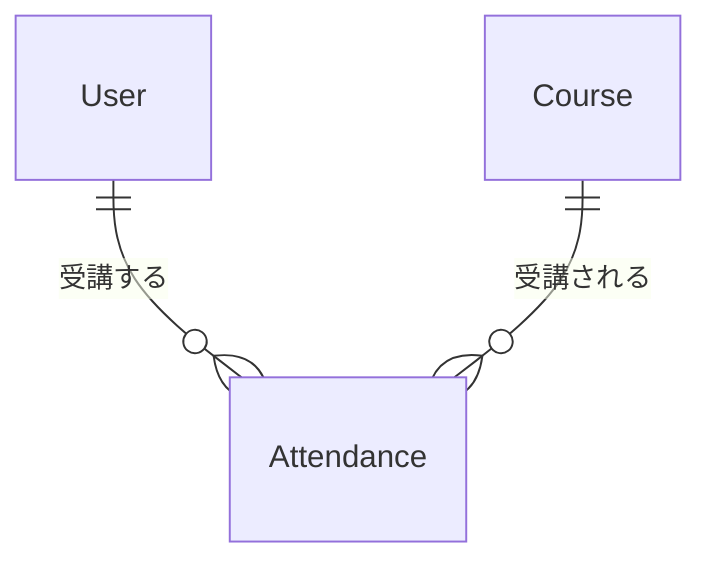

# Lesson 11 データベース設計の基礎

## 学習目標

このレッスンでは、堅牢なデータベース設計の原則を理解し、適切なマイグレーションを書けるようになります。

### 到達目標
- 外部キー制約を正しく設定できる
- インデックスの役割と追加タイミングを理解する
- NULL許可のデメリットを理解し適切に設計できる
- attendances（受講）テーブルを設計できる

## データベース設計の重要性

データベースはアプリケーションの土台です。

設計を間違えると、データの整合性が崩れたり、パフォーマンスが悪化したり、後からの修正が困難になります。

## Step 1 Attendancesテーブルの設計

### エンティティ分析

受講（Attendance）は、ユーザーと講座の多対多の関係を表します。



1人のユーザーは複数の講座を受講でき、1つの講座には複数の受講者がいます。

### マイグレーションの作成

```bash
php artisan make:migration create_attendances_table
```

### マイグレーションの実装

```php
<?php

use Illuminate\Database\Migrations\Migration;
use Illuminate\Database\Schema\Blueprint;
use Illuminate\Support\Facades\Schema;
use App\Models\User;
use App\Models\Course;

return new class extends Migration
{
    public function up(): void
    {
        Schema::create('attendances', function (Blueprint $table) {
            $table->id();

            // 外部キー
            $table->foreignIdFor(User::class)
                ->constrained()
                ->onDelete('cascade');

            $table->foreignIdFor(Course::class)
                ->constrained()
                ->onDelete('cascade');

            // 受講状態
            $table->string('status')->default('attending');

            // 受講日時
            $table->timestamp('attended_at')->useCurrent();

            $table->timestamps();

            // 複合ユニーク制約（同じ講座に2回登録できない）
            $table->unique(['user_id', 'course_id']);
        });
    }

    public function down(): void
    {
        Schema::dropIfExists('attendances');
    }
};
```

## Step 2 外部キー制約

### 外部キー制約とは

外部キー制約は、テーブル間の参照整合性を保証する仕組みです。

```php
$table->foreignIdFor(User::class)->constrained();
```

これにより、`user_id` に存在しないユーザーIDを入れようとするとエラーになり、データの整合性が保証されます。

### onDelete オプション

参照先が削除された時の動作を指定します。

```php
// CASCADE: 親が削除されたら子も削除
$table->foreignIdFor(User::class)
    ->constrained()
    ->onDelete('cascade');

// SET NULL: 親が削除されたらNULLに
$table->foreignIdFor(User::class, 'instructor_id')
    ->nullable()
    ->constrained('users')
    ->onDelete('set null');

// RESTRICT: 子がいる場合は削除を拒否（デフォルト）
$table->foreignIdFor(Category::class)
    ->constrained()
    ->onDelete('restrict');
```

### 使い分けの指針

| オプション | 用途例 |
|-----------|--------|
| cascade | 親が消えたら子も不要（受講情報、コメントなど） |
| set null | 参照は消えるが履歴は残したい（担当者の退職など） |
| restrict | 削除させたくない（カテゴリに商品があれば削除不可） |

## Step 3 インデックス

### インデックスとは

インデックスは、検索を高速化するための索引です。

本の索引をイメージしてください。索引がない場合は本を最初から読んで探す必要がありますが（フルスキャン）、索引があれば該当箇所を特定してジャンプできます。

### インデックスが必要な場面

```php
// WHERE句で頻繁に使うカラム
$table->string('status')->index();

// 検索・ソートに使うカラム
$table->timestamp('attended_at')->index();

// 外部キー（自動的にインデックスが作成される）
$table->foreignIdFor(User::class)->constrained();
```

### 複合インデックス

複数カラムを組み合わせた検索に有効です。

```php
// user_id と status の組み合わせで検索することが多い場合
$table->index(['user_id', 'status']);
```

### インデックスのデメリット

インデックスには書き込みが遅くなる（INSERT/UPDATE時にインデックスも更新）、ストレージを消費する（インデックス分の容量が必要）というデメリットがあります。

原則として、検索に使うカラムにのみ追加してください。

## Step 4 NULL許可のデメリット

### NULLとは

`NULL` は「値がない」状態を表します。空文字 `''` とは異なります。

### NULLの問題点

#### 1. 比較が直感的でない

```php
// NULLは等価比較できない
SELECT * FROM users WHERE email = NULL;  -- 結果は0件
SELECT * FROM users WHERE email IS NULL; -- これが正しい
```

#### 2. 集計が複雑になる

```php
// NULLは集計から除外される
SELECT AVG(score) FROM exams;  -- NULL以外の平均
SELECT COUNT(score) FROM exams; -- NULL以外の件数
SELECT COUNT(*) FROM exams;     -- 全件数
```

#### 3. コードが複雑になる

```php
// NULLチェックが必要
if ($user->phone !== null) {
    // 電話番号がある場合の処理
}

// NULLセーフな書き方
$phone = $user->phone ?? 'なし';
```

### NULL vs NOT NULL + デフォルト値

```php
// ❌ NULLを許可
$table->string('nickname')->nullable();

// ✅ NOT NULL + デフォルト値
$table->string('nickname')->default('');

// ❌ NULLを許可
$table->integer('login_count')->nullable();

// ✅ NOT NULL + デフォルト値
$table->integer('login_count')->default(0);
```

### NULLが適切なケース

- 「未設定」と「空」を区別する必要がある
- 外部キーで「関連なし」を表現する

```php
// 講師が退職した場合 → NULLにする（履歴は残す）
$table->foreignIdFor(User::class, 'instructor_id')
    ->nullable()
    ->constrained('users')
    ->onDelete('set null');
```

## Step 5 複合ユニーク制約

### 問題（重複登録を防ぐ）

同じユーザーが同じ講座に2回登録することを防ぎたい。

### アプリケーションレベルでの対策

```php
// ❌ 不十分（競合状態で漏れる可能性）
if (Attendance::where('user_id', $userId)->where('course_id', $courseId)->exists()) {
    throw new AlreadyAttendedException();
}
Attendance::create([...]);
```

### データベースレベルでの対策

```php
// ✅ 複合ユニーク制約
$table->unique(['user_id', 'course_id']);
```

これにより、重複挿入時にDBがエラーを返します。

### 例外処理

```php
use Illuminate\Database\QueryException;

try {
    Attendance::create([
        'user_id' => $userId,
        'course_id' => $courseId,
    ]);
} catch (QueryException $e) {
    if ($e->errorInfo[1] === 1062) {  // Duplicate entry
        throw new AlreadyAttendedException();
    }
    throw $e;
}
```

## Step 6 Attendanceモデルの作成

### モデルの作成

```bash
php artisan make:model Attendance
```

### Attendanceモデルの実装

```php
<?php

namespace App\Models;

use App\Enums\AttendanceStatus;
use Illuminate\Database\Eloquent\Model;
use Illuminate\Database\Eloquent\Relations\BelongsTo;

class Attendance extends Model
{
    protected $fillable = [
        'user_id',
        'course_id',
        'status',
        'attended_at',
    ];

    protected function casts(): array
    {
        return [
            'status' => AttendanceStatus::class,
            'attended_at' => 'datetime',
        ];
    }

    public function user(): BelongsTo
    {
        return $this->belongsTo(User::class);
    }

    public function course(): BelongsTo
    {
        return $this->belongsTo(Course::class);
    }
}
```

### AttendanceStatus Enum

```php
<?php

namespace App\Enums;

enum AttendanceStatus: string
{
    case Attending = 'attending';
    case Completed = 'completed';
    case Cancelled = 'cancelled';

    public function label(): string
    {
        return match($this) {
            self::Attending => '受講中',
            self::Completed => '修了',
            self::Cancelled => 'キャンセル',
        };
    }
}
```

### User と Course にリレーションを追加

```php
// User.php
public function attendances(): HasMany
{
    return $this->hasMany(Attendance::class);
}

public function attendedCourses(): BelongsToMany
{
    return $this->belongsToMany(Course::class, 'attendances')
        ->withPivot('status', 'attended_at')
        ->withTimestamps();
}

// Course.php
public function attendances(): HasMany
{
    return $this->hasMany(Attendance::class);
}

public function students(): BelongsToMany
{
    return $this->belongsToMany(User::class, 'attendances')
        ->withPivot('status', 'attended_at')
        ->withTimestamps();
}

public function hasCapacity(): bool
{
    return $this->attendances()->count() < $this->capacity;
}
```

## Step 7 マイグレーションのベストプラクティス

### 1. 小さな単位で作成

```bash
# ✅ 1つの変更 = 1つのマイグレーション
php artisan make:migration add_phone_to_users_table
php artisan make:migration add_index_to_attendances_status

# ❌ 複数の無関係な変更を1つに
php artisan make:migration update_multiple_tables
```

### 2. down() メソッドを実装

```php
public function up(): void
{
    Schema::table('users', function (Blueprint $table) {
        $table->string('phone')->nullable()->after('email');
    });
}

public function down(): void
{
    Schema::table('users', function (Blueprint $table) {
        $table->dropColumn('phone');
    });
}
```

### 3. 本番データがある場合の変更

```php
// NOT NULL カラムを追加する場合
public function up(): void
{
    Schema::table('users', function (Blueprint $table) {
        // 一旦nullable で追加
        $table->string('nickname')->nullable();
    });

    // デフォルト値を設定
    DB::table('users')->whereNull('nickname')->update(['nickname' => '']);

    // NOT NULLに変更
    Schema::table('users', function (Blueprint $table) {
        $table->string('nickname')->nullable(false)->change();
    });
}
```

### 4. 破壊的変更は慎重に

本番環境でのカラム削除・リネームには注意が必要です。

```php
// ❌ いきなり削除
$table->dropColumn('old_column');

// ✅ 段階的に
// 1. 新カラム追加
// 2. データ移行
// 3. アプリケーション更新
// 4. 旧カラム削除
```

## Step 8 受講登録APIで動作確認

ここまでで設計したテーブル・モデル・制約が正しく機能するか、実際にAPIを1つ作って確認しましょう。

### AttendanceResource の作成

```bash
php artisan make:resource AttendanceResource
```

```php
<?php

namespace App\Http\Resources;

use Illuminate\Http\Request;
use Illuminate\Http\Resources\Json\JsonResource;

class AttendanceResource extends JsonResource
{
    /** @var \App\Models\Attendance */
    public $resource;

    public function toArray(Request $request): array
    {
        return [
            'id' => $this->resource->id,
            'user' => new UserResource($this->resource->user),
            'course' => new CourseResource($this->resource->course),
            'status' => $this->resource->status,
            'status_label' => $this->resource->status->label(),
            'attended_at' => $this->resource->attended_at->toISOString(),
        ];
    }
}
```

### AttendanceController の作成

```bash
php artisan make:controller Api/AttendanceController
```

```php
<?php

namespace App\Http\Controllers\Api;

use App\Http\Controllers\Controller;
use App\Http\Resources\AttendanceResource;
use App\Models\Attendance;
use App\Models\Course;
use Illuminate\Database\QueryException;
use Illuminate\Http\Request;

class AttendanceController extends Controller
{
    /**
     * 受講登録
     */
    public function store(Request $request, Course $course)
    {
        // 定員チェック
        if (!$course->hasCapacity()) {
            return response()->json([
                'message' => 'この講座は定員に達しています。',
            ], 422);
        }

        // 受講登録（重複時はDBの複合ユニーク制約でエラー）
        try {
            $attendance = Attendance::create([
                'user_id' => $request->user()->id,
                'course_id' => $course->id,
                'status' => \App\Enums\AttendanceStatus::Attending,
                'attended_at' => now(),
            ]);
        } catch (QueryException $e) {
            if ($e->errorInfo[1] === 1062) {
                return response()->json([
                    'message' => 'すでにこの講座に登録済みです。',
                ], 409);
            }
            throw $e;
        }

        $attendance->load(['user', 'course.instructor']);

        return new AttendanceResource($attendance);
    }
}
```

ポイント
- `hasCapacity()` で定員チェック（Step 6 で定義したメソッド）
- 複合ユニーク制約違反は `QueryException` をキャッチして 409 Conflict を返す
- アプリ側チェックだけでなく、DB制約が最後の砦として機能する

### ルート追加

`routes/api.php` の `auth:sanctum` グループ内に追加します。

```php
Route::middleware('auth:sanctum')->group(function () {
    // ...既存のルート...

    // 受講登録
    Route::post('/courses/{course}/attendances', [\App\Http\Controllers\Api\AttendanceController::class, 'store']);
});
```

### 動作確認

Postmanで確認してください。

#### 1. 生徒でログイン
#### 2. 受講登録（成功）
#### 3. 同じ講座に再度登録（重複エラー）
#### 4. 定員オーバー確認

## 練習問題

### 問題1
以下の要件を満たすマイグレーションを作成してください。

- `course_reviews` テーブル
- 講座に対するレビュー（1講座につき1ユーザー1レビュー）
- 評価（1-5の整数、必須）
- コメント（任意）

<details>
<summary>解答例</summary>

```php
Schema::create('course_reviews', function (Blueprint $table) {
    $table->id();
    $table->foreignIdFor(User::class)->constrained()->onDelete('cascade');
    $table->foreignIdFor(Course::class)->constrained()->onDelete('cascade');
    $table->unsignedTinyInteger('rating');  // 1-5
    $table->text('comment')->nullable();
    $table->timestamps();

    $table->unique(['user_id', 'course_id']);
    $table->index('course_id');  // 講座ごとのレビュー取得用
});
```
</details>

### 問題2
既存の `courses` テーブルに `starts_at` カラム（NOT NULL）を追加するマイグレーションを作成してください。既存データには今日の日付を設定します。

<details>
<summary>解答例</summary>

```php
public function up(): void
{
    Schema::table('courses', function (Blueprint $table) {
        $table->datetime('starts_at')->nullable()->after('status');
    });

    // 既存データにデフォルト値を設定
    DB::table('courses')
        ->whereNull('starts_at')
        ->update(['starts_at' => now()]);

    // NOT NULLに変更
    Schema::table('courses', function (Blueprint $table) {
        $table->datetime('starts_at')->nullable(false)->change();
    });
}

public function down(): void
{
    Schema::table('courses', function (Blueprint $table) {
        $table->dropColumn('starts_at');
    });
}
```
</details>

## 次のレッスン

[Lesson 12 N+1問題を解決する](./12-n-plus-one.md) では、パフォーマンスを低下させるN+1問題とその解決方法を学びます。
