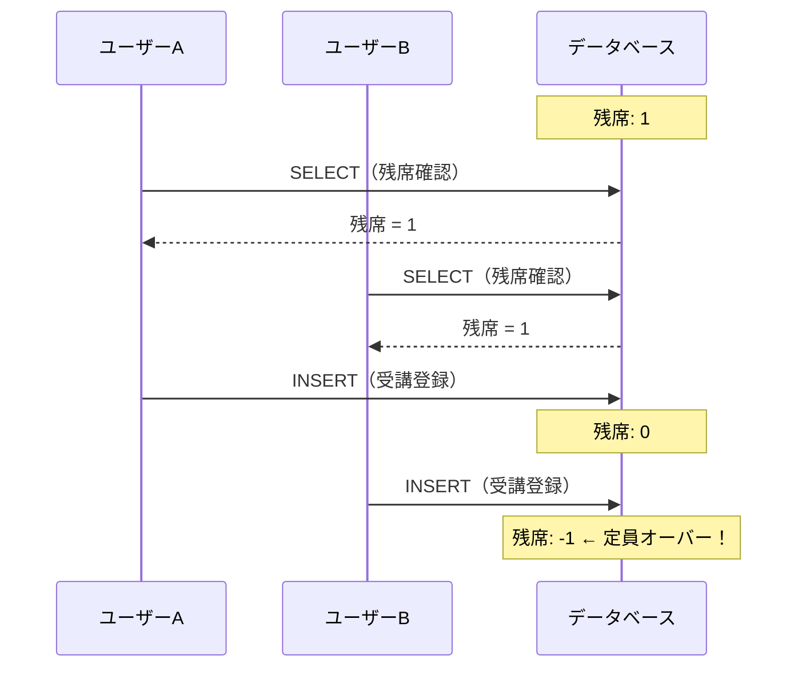
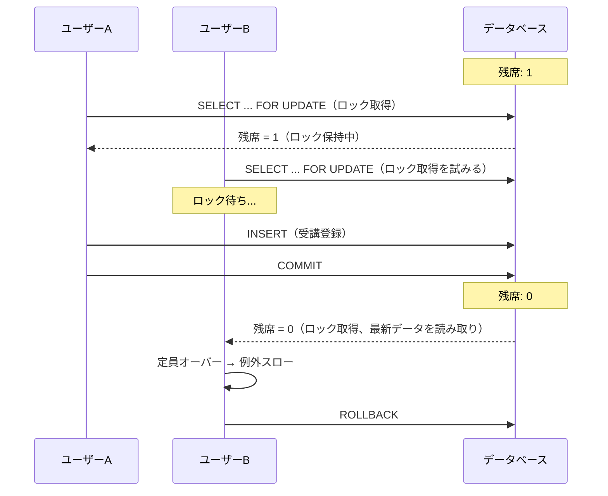

# Lesson 14 トランザクション処理

## 学習目標

このレッスンでは、データの整合性を保つためのトランザクション処理を適切に実装できるようになります。

### 到達目標
- トランザクションの必要性を理解する
- `DB::transaction()` を使える
- 例外発生時のロールバックを理解する
- 排他ロック（lockForUpdate）の必要性と仕組みを理解する
- デッドロック対策ができる

> サンプルコードは、講座に「受講者数を保持するカラム」`courses.attendance_count` がある前提で書いています。**このカラムは本プロジェクトには存在せず、このコースでも追加しません**（実際の残席チェックは Lesson 11 で作った `Course::hasCapacity()` が `attendances` を数える方式です）。「1つの処理で複数のテーブル／行を更新する」状況を分かりやすく示すための仮の題材として読んでください。

> このレッスンでは、Eloquentが内部で発行するSQLや、MySQLのロックの仕組みが説明のために登場します。生のSQLを読み書きできる必要はありません。「Eloquentのこのメソッドを呼ぶと、DB側でこういうことが起きる」という対応関係だけ掴めれば十分です。SQLの行は日本語の説明とセットで読んでください。


## トランザクションとは？

### 問題のあるコード

受講登録処理を考えます。

```php
public function attend(User $user, Course $course)
{
    // 1. 受講レコードを作成
    $attendance = Attendance::create([
        'user_id' => $user->id,
        'course_id' => $course->id,
    ]);

    // 2. 講座の受講者数を更新
    $course->increment('attendance_count');

    // 3. 通知メールを送信（ここで例外発生！）
    Mail::to($user)->send(new AttendanceConfirmation($attendance));
    // ↑ メール送信に失敗すると例外がスローされる

    return $attendance;
}
```

メール送信で失敗した場合、以下のような問題が発生します。

- 受講レコードは作成済み ✓
- 講座の受講者数は更新済み ✓
- メールは送信されていない ✗

このようにデータの不整合が発生します。


## Step 1 DB::transaction() で解決

### 基本的な使い方

```php
use Illuminate\Support\Facades\DB;

public function attend(User $user, Course $course)
{
    return DB::transaction(function () use ($user, $course) {
        // 1. 受講レコードを作成
        $attendance = Attendance::create([
            'user_id' => $user->id,
            'course_id' => $course->id,
        ]);

        // 2. 講座の受講者数を更新
        $course->increment('attendance_count');

        // 3. メール送信（DB操作の外で行う）
        // ここでは行わない

        return $attendance;
    });
}
```

`DB::transaction()` 内で例外が発生すると、全ての変更がロールバックされます。

### メール送信はトランザクションの外で

```php
public function attend(User $user, Course $course)
{
    // トランザクション内でDB操作
    $attendance = DB::transaction(function () use ($user, $course) {
        $attendance = Attendance::create([
            'user_id' => $user->id,
            'course_id' => $course->id,
        ]);

        $course->increment('attendance_count');

        return $attendance;
    });

    // トランザクションの外でメール送信
    Mail::to($user)->send(new AttendanceConfirmation($attendance));

    return $attendance;
}
```

### 例外の再スロー

トランザクション内で例外をキャッチして処理する場合は以下のようにします。

```php
DB::transaction(function () {
    try {
        // 処理
    } catch (SomeException $e) {
        // ログに記録
        Log::error('エラー発生', ['message' => $e->getMessage()]);

        // 必ず再スローしてロールバック
        throw $e;
    }
});
```


## Step 2 手動トランザクション制御

### より細かい制御が必要な場合

```php
use Illuminate\Support\Facades\DB;

public function complexOperation()
{
    DB::beginTransaction();

    try {
        // 操作1
        $user = User::create([...]);

        // 操作2
        $course = Course::create([...]);

        // 操作3（条件付き）
        if ($someCondition) {
            Attendance::create([...]);
        }

        // 全て成功したらコミット
        DB::commit();

        return $user;

    } catch (\Exception $e) {
        // エラー時はロールバック
        DB::rollBack();

        Log::error('操作失敗', ['error' => $e->getMessage()]);

        throw $e;
    }
}
```

### DB::transaction() vs 手動制御

| 方法 | 利点 | 欠点 |
|------|------|------|
| `DB::transaction()` | シンプル、例外時に自動ロールバック | 細かい制御が難しい |
| 手動（begin/commit/rollback） | 柔軟な制御が可能 | 書き忘れのリスク |

特別な理由がなければ `DB::transaction()` を使うことを推奨します。


## Step 3 排他制御（ロック）

> 重要: このStepの説明は MySQL / PostgreSQL を前提としています。
> 本プロジェクトのDBは SQLite で、SQLite のドライバでは `lockForUpdate()` は
> 何も出力しません（`SELECT ... FOR UPDATE` は付かず、素の SELECT になります）。
>
> ```bash
> php artisan tinker --execute 'echo Course::whereKey(1)->lockForUpdate()->toRawSql();'
> # select * from "courses" where "courses"."id" = 1   ← FOR UPDATE が付かない
> ```
>
> つまり、このStepのコードをそのまま書いても、この環境では排他制御は効きません。
> 「実務でMySQLを使うときに何が起きるか」を理解するための座学パートとして読み進めてください。
> SQLite はDB全体をロックする方式のため、そもそも行単位のロックという概念がありません。

### 競合状態の問題

2人のユーザーが同時に残り1席の講座に申し込む場合を考えます。

```
ユーザーA: 残席確認 → 1席 → 登録実行
ユーザーB: 残席確認 → 1席 → 登録実行
→ 2人とも登録できてしまう（定員オーバー）
```

シーケンス図で見ると、問題がより明確になります。



AとBがほぼ同時に残席を確認し、どちらも「1席ある」と判断して登録を実行してしまいます。

### なぜ DB::transaction() だけでは不十分か

「トランザクションで囲めば安全」と思いがちですが、通常の SELECT はロックを取りません。

`DB::transaction()` 内で `Course::find($courseId)` を実行しても、その行にロックはかかりません。他のトランザクションも同じ行を同時に読み取れるため、上の競合状態は解決しません。

トランザクションが保証するのは「全部成功するか、全部なかったことにするか」であって、「処理の途中で他のリクエストに割り込まれないこと」ではありません。この2つは別の問題で、後者にはロックが必要です。

> 用語補足: MySQL のデフォルト分離レベル（REPEATABLE READ）では、トランザクション内の SELECT は MVCC（Multi-Version Concurrency Control）のスナップショット読み取りを使います。ざっくり言えば「トランザクションを開始した時点のデータのコピーを読む」仕組みで、他のトランザクションが同じ行を触っていても待たされません。読み取りを速くするための仕組みですが、その代わり「読んだ直後に他の人が更新してしまう」ことは防げません。分離レベルやMVCCの詳細は、いまの段階では覚えなくて構いません。

### lockForUpdate とは

`lockForUpdate()` は SQL の `SELECT ... FOR UPDATE` を発行し、対象の行に排他ロック（Xロック）を取得します。

```sql
-- lockForUpdate() が発行するSQL
SELECT * FROM courses WHERE id = 1 FOR UPDATE;
```

> 末尾の `FOR UPDATE` が「この行はこれから更新するので、他の人は触らないでほしい」という宣言です。SQLとして書けるようになる必要はなく、`lockForUpdate()` を付けるとこの宣言が付く、と理解できていれば十分です。

排他ロックを取得すると、他のトランザクションは同じ行のロック取得をブロックされます。つまり、先にロックを取ったトランザクションがコミットまたはロールバックするまで、後からのトランザクションは待機します。

### lockForUpdate で解決する

```php
public function attend(User $user, int $courseId)
{
    return DB::transaction(function () use ($user, $courseId) {
        // 行ロックを取得（他のトランザクションは待機）
        $course = Course::lockForUpdate()->find($courseId);

        if (!$course->hasCapacity()) {
            throw new CapacityExceededException();
        }

        $attendance = Attendance::create([
            'user_id' => $user->id,
            'course_id' => $course->id,
        ]);

        $course->increment('attendance_count');

        return $attendance;
    });
}
```

`lockForUpdate()` を使うことで、同時リクエストは以下のように直列化されます。



ユーザーBはユーザーAのコミット後にロックを取得するため、最新の残席数（0）を読み取り、正しく登録を拒否できます。

### 共有ロックと排他ロックの比較

以下は違いを整理した参考表です。このレッスンで使うのは `lockForUpdate()` だけなので、表を暗記する必要はありません。「読むだけなら共有ロック、読んだ値を元に更新するなら排他ロック」とだけ覚えておけば、必要になったときに調べ直せます。

| 項目 | `sharedLock()` | `lockForUpdate()` |
|------|---------------|-------------------|
| SQL | `SELECT ... LOCK IN SHARE MODE` | `SELECT ... FOR UPDATE` |
| ロック種別 | 共有ロック（Sロック） | 排他ロック（Xロック） |
| 他のSロック | 共存できる | ブロックする |
| 他のXロック | ブロックする | ブロックする |
| 主な用途 | 読み取り中の変更を防ぐ | 読み取り後に更新する |

今回のように「読み取った値に基づいて更新する」パターンでは、`lockForUpdate()` を使います。

### 通常の SELECT はブロックされない

排他ロックがかかっている行でも、通常の SELECT はブロックされません。MVCCにより、ロックを取得せずにスナップショットからデータを読み取るためです。

ブロックされるもの（ロック待ちになる）:
- `lockForUpdate()` / `SELECT ... FOR UPDATE`
- `sharedLock()` / `SELECT ... LOCK IN SHARE MODE`
- `UPDATE` / `DELETE` 文

ブロックされないもの:
- 通常の `SELECT`（`Course::find()` など）

したがって、排他ロックを使っても、ロックに関係しない通常の読み取りクエリ（一覧画面の表示など）には影響しません。


## Step 4 デッドロック対策

### デッドロックとは？

2つのトランザクションが互いにロックを待ち合う状態です。

```
トランザクションA: users をロック → courses のロックを待つ
トランザクションB: courses をロック → users のロックを待つ
→ 永久に待ち続ける（デッドロック）
```

### 対策1 ロック順序を統一

```php
// ✅ 常に同じ順序でロック
DB::transaction(function () {
    $course = Course::lockForUpdate()->find($courseId);
    $user = User::lockForUpdate()->find($userId);
    // ...
});
```

### 対策2 リトライ処理

```php
use Illuminate\Database\DeadlockException;

$maxAttempts = 3;
$attempt = 0;

while ($attempt < $maxAttempts) {
    try {
        return DB::transaction(function () use ($user, $course) {
            // 処理
        });
    } catch (DeadlockException $e) {
        $attempt++;
        if ($attempt >= $maxAttempts) {
            throw $e;
        }
        // 少し待ってからリトライ
        usleep(100000);  // 100ms
    }
}
```

### DB::transaction() のリトライ機能

`DB::transaction()` は第2引数でリトライ回数を指定できます。

```php
DB::transaction(function () {
    // 処理
}, 5);  // デッドロック時に最大5回リトライ
```


## Step 5 サービスクラスへの切り出し（先取り）

> このStepは、これから先のレッスンの完成形を先に見ておくためのサンプルです。この時点ではまだ作っていないクラスを参照しているため、そのまま写しても動きません。手を動かすのは以下のレッスンです。
>
> | 参照しているもの | 実際に作るレッスン |
> |---|---|
> | `App\Exceptions\CourseNotActiveException` など3つの例外 | Lesson 16（`BusinessException` を継承する形で作ります） |
> | `App\Mail\AttendanceConfirmation` | Lesson 18 |
> | `App\Services\` へのサービスクラスの切り出し | Lesson 16（講座）・Lesson 19（受講キャンセル） |
>
> いま読み取ってほしいのは、「DB操作は `DB::transaction()` の中に閉じ、メール送信はその外に出す」という構造だけです。受講登録API自体は Lesson 11 で実装済みのものがそのまま動いています。

### AttendanceService

```php
<?php

namespace App\Services;

use App\Enums\AttendanceStatus;
use App\Exceptions\AlreadyAttendingException;
use App\Exceptions\CapacityExceededException;
use App\Exceptions\CourseNotActiveException;
use App\Models\Course;
use App\Models\Attendance;
use App\Models\User;
use Illuminate\Support\Facades\DB;

class AttendanceService
{
    public function attend(User $user, int $courseId): Attendance
    {
        return DB::transaction(function () use ($user, $courseId) {
            // 講座をロック付きで取得
            $course = Course::lockForUpdate()->findOrFail($courseId);

            // バリデーション
            $this->validateAttendance($user, $course);

            // 受講レコードを作成
            $attendance = Attendance::create([
                'user_id' => $user->id,
                'course_id' => $course->id,
                'status' => AttendanceStatus::Attending,
                'attended_at' => now(),
            ]);

            return $attendance;
        }, 3);  // デッドロック時に3回リトライ
    }

    private function validateAttendance(User $user, Course $course): void
    {
        // 講座が公開中か確認
        if (!$course->isActive()) {
            throw new CourseNotActiveException();
        }

        // 定員確認
        if (!$course->hasCapacity()) {
            throw new CapacityExceededException();
        }

        // 重複登録確認
        $exists = Attendance::where('user_id', $user->id)
            ->where('course_id', $course->id)
            ->exists();

        if ($exists) {
            throw new AlreadyAttendingException();
        }
    }
}
```

### TIPS: リレーション経由の作成で外部キーの指定を省略する

上記の `attend` メソッドでは `Attendance::create()` に `user_id` を明示的に渡していますが、Lesson 11 で定義した `attendances()` リレーションを使うとよりシンプルに書けます。

```php
// Before
$attendance = Attendance::create([
    'user_id' => $user->id,
    'course_id' => $course->id,
    'status' => AttendanceStatus::Attending,
    'attended_at' => now(),
]);

// After: $user->attendances() 経由で作成すると user_id が自動セットされる
$attendance = $user->attendances()->create([
    'course_id' => $course->id,
    'status' => AttendanceStatus::Attending,
    'attended_at' => now(),
]);
```

HasMany リレーションの `create()` は親モデルの外部キーを自動的にセットするため、`user_id` の指定が不要になります。外部キーの書き間違いも防げるので、リレーションが定義されている場合は積極的に活用しましょう。

### AttendanceController

```php
<?php

namespace App\Http\Controllers\Api;

use App\Http\Controllers\Controller;
use App\Http\Resources\AttendanceResource;
use App\Mail\AttendanceConfirmation;
use App\Models\Course;
use App\Services\AttendanceService;
use Illuminate\Http\Request;
use Illuminate\Support\Facades\Mail;

class AttendanceController extends Controller
{
    public function __construct(
        private AttendanceService $attendanceService
    ) {}

    public function store(Request $request, Course $course)
    {
        // トランザクション内でDB操作
        $attendance = $this->attendanceService->attend(
            $request->user(),
            $course->id
        );

        // トランザクション外でメール送信
        Mail::to($request->user())->send(
            new AttendanceConfirmation($attendance)
        );

        return new AttendanceResource($attendance);
    }
}
```


## Step 6 トランザクションのテスト

### テストでのトランザクション確認

```php
use App\Models\Course;
use App\Models\User;

test('定員オーバー時は受講レコードが作られない', function () {
    $user = User::factory()->student()->create();
    $course = Course::factory()->active()->create(['capacity' => 1]);

    // 1人目は成功
    $this->actingAs($user)
        ->postJson("/api/courses/{$course->id}/attendances")
        ->assertCreated();

    // 2人目は失敗（定員オーバー）
    $anotherUser = User::factory()->student()->create();
    $this->actingAs($anotherUser)
        ->postJson("/api/courses/{$course->id}/attendances")
        ->assertUnprocessable();

    // 受講レコードは1件のみ
    $this->assertDatabaseCount('attendances', 1);
});
```

> テストの書き方そのものは Lesson 17 で学びます。ここでは「失敗したリクエストが中途半端なデータを残していないこと」を、レコード件数で確認できる、という点だけ押さえてください。

## 練習問題

### 問題1
以下のコードにトランザクションを追加してください。

```php
public function transfer(User $from, User $to, int $amount)
{
    $from->decrement('balance', $amount);
    $to->increment('balance', $amount);
}
```

<details>
<summary>解答例</summary>

```php
use Illuminate\Support\Facades\DB;

public function transfer(User $from, User $to, int $amount)
{
    DB::transaction(function () use ($from, $to, $amount) {
        $from->decrement('balance', $amount);
        $to->increment('balance', $amount);
    });
}
```
</details>

### 問題2
受講キャンセル処理を実装してください。受講ステータスを `cancelled` に変更し、講座の `attendance_count` を減らします。

<details>
<summary>解答例</summary>

```php
use Illuminate\Support\Facades\DB;

public function cancel(User $user, Course $course): void
{
    DB::transaction(function () use ($user, $course) {
        $attendance = Attendance::where('user_id', $user->id)
            ->where('course_id', $course->id)
            ->where('status', AttendanceStatus::Attending)
            ->firstOrFail();

        $attendance->update([
            'status' => AttendanceStatus::Cancelled,
        ]);

        $course->decrement('attendance_count');
    });
}
```
</details>

## 参考資料

- [Laravel 公式ドキュメント - Database Transactions](https://laravel.com/docs/database#database-transactions)
- [Laravel 公式ドキュメント - Pessimistic Locking](https://laravel.com/docs/queries#pessimistic-locking)

## 次のレッスン

[Lesson 15 サービスコンテナとDI](./15-di-container.md) では、Laravelのサービスコンテナの仕組みと依存性注入（DI）を学びます。
