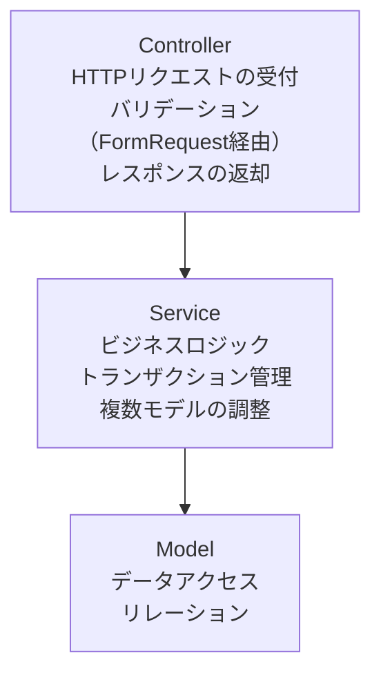
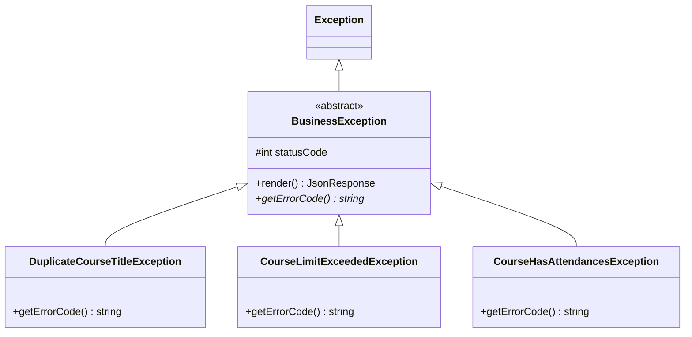
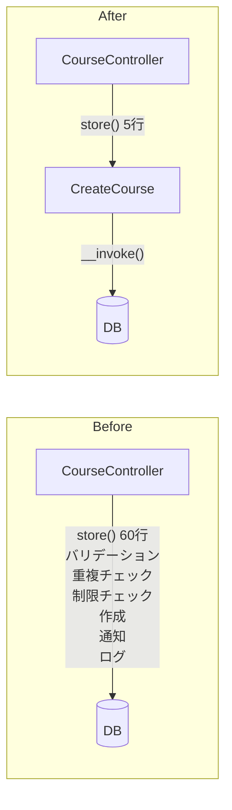
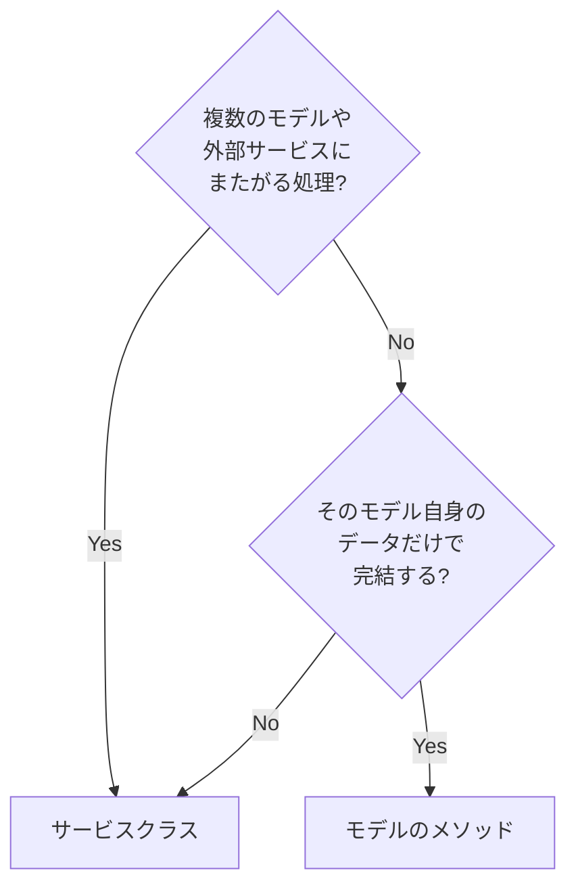

# Lesson 16 サービスクラスの設計

## 学習目標

このレッスンでは、ビジネスロジックをサービスクラスに分離し、保守性の高い設計を実践します。

### 到達目標
- Fat Controller の問題を理解する
- `__invoke` を使った単一責任のサービスクラスを設計できる
- カスタム例外クラスを作成できる
- コントローラーを薄く保てる

> このレッスンは、プロジェクトのコードを実際に書き換えるハンズオンです。Step 1〜3 で作る `app/Services/Course/` と `app/Exceptions/` のクラス、および `CourseController` の書き換えは、実際にファイルを作成してください。
>
> Lesson 15 との関係: Lesson 15 ではインターフェース（`AttendanceServiceInterface` など）を紹介しましたが、本コースの実装方針は、インターフェースを切らず、具象クラス（`CreateCourse` など）をそのままコンストラクタに注入する形です。実装が1つしかないうちはインターフェースを増やしても得るものが少ないためです（判断基準は Lesson 15 末尾の「いつインターフェースを切るか」）。Lesson 15 で登場した `AttendanceService` は説明用の仮の題材なので、ここでは使いません。


## Fat Controller の問題

### 問題のあるコード

```php
class CourseController extends Controller
{
    public function store(Request $request)
    {
        // バリデーション
        $validated = $request->validate([
            'title' => ['required', 'string', 'max:255'],
            'capacity' => ['required', 'integer', 'min:1'],
        ]);

        // 重複チェック
        $exists = Course::where('instructor_id', $request->user()->id)
            ->where('title', $validated['title'])
            ->exists();
        if ($exists) {
            return response()->json(['error' => '同じタイトルの講座があります'], 422);
        }

        // 講師の講座数制限チェック
        $count = Course::where('instructor_id', $request->user()->id)->count();
        if ($count >= 10) {
            return response()->json(['error' => '講座数の上限に達しています'], 422);
        }

        // 講座作成
        $course = Course::create([
            ...$validated,
            'instructor_id' => $request->user()->id,
            'status' => 'draft',
        ]);

        // 管理者に通知
        $admins = User::where('role', 'admin')->get();
        foreach ($admins as $admin) {
            Mail::to($admin)->send(new NewCourseNotification($course));
        }

        // ログ記録
        Log::info('講座作成', ['course_id' => $course->id]);

        return new CourseResource($course);
    }
}
```

このコードには以下の問題点があります。
- コントローラーが肥大化（100行以上になることも）
- ビジネスロジックとHTTP処理が混在
- テストが困難
- 再利用できない


## サービスクラスの役割

### 責務の分離



### `__invoke` による単一責任の設計

本レッスンでは、1つのサービスクラスに1つの操作だけを持たせます。PHPのマジックメソッド `__invoke` を使うことで、クラス自体を関数のように呼び出せます。

```php
// 1クラス = 1操作
$course = ($this->createCourse)($data, $instructor);
```

メリットは以下の通りです。
- クラスの責務が明確（クラス名 = やること）
- テストが書きやすい（1クラスに1つのパブリックメソッド）
- 依存関係が最小限になる


## Step 1 講座作成サービスの作成

### ディレクトリ構成

```
app/
├── Http/
│   └── Controllers/
│       └── Api/
│           └── CourseController.php
├── Services/
│   └── Course/
│       ├── CreateCourse.php
│       ├── UpdateCourse.php
│       └── DeleteCourse.php
└── Exceptions/
    ├── BusinessException.php
    ├── DuplicateCourseTitleException.php
    ├── CourseLimitExceededException.php
    └── CourseHasAttendancesException.php
```

操作ごとにファイルを分けることで、どのファイルに何が書いてあるか一目でわかります。

### CreateCourse

```php
<?php

namespace App\Services\Course;

use App\Exceptions\CourseLimitExceededException;
use App\Exceptions\DuplicateCourseTitleException;
use App\Models\Course;
use App\Models\User;
use Illuminate\Support\Facades\DB;
use Illuminate\Support\Facades\Log;

class CreateCourse
{
    private const MAX_COURSES_PER_INSTRUCTOR = 10;

    public function __invoke(array $data, User $instructor): Course
    {
        $this->validate($data, $instructor);

        return DB::transaction(function () use ($data, $instructor) {
            $course = Course::create([
                ...$data,
                'instructor_id' => $instructor->id,
            ]);

            Log::info('講座が作成されました', [
                'course_id' => $course->id,
                'instructor_id' => $instructor->id,
            ]);

            return $course->load('instructor');
        });
    }

    private function validate(array $data, User $instructor): void
    {
        $exists = Course::where('instructor_id', $instructor->id)
            ->where('title', $data['title'])
            ->exists();

        if ($exists) {
            throw new DuplicateCourseTitleException();
        }

        $count = Course::where('instructor_id', $instructor->id)->count();

        if ($count >= self::MAX_COURSES_PER_INSTRUCTOR) {
            throw new CourseLimitExceededException();
        }
    }
}
```

ポイントは以下の通りです。
- `__invoke` がこのクラスの唯一のパブリックメソッド
- バリデーションはプライベートメソッドで整理
- 他のサービスへの依存がなく、このクラスだけで完結している
- `status` は `Course/StoreRequest` で検証済みの値をそのまま使う。ここで `CourseStatus::Draft` に固定してしまうと、リクエストで必須にしている項目を無視することになり、APIの挙動と仕様が食い違う
- 戻り値で `load('instructor')` しておくことで、`CourseResource` の `instructor` が Lesson 9 と同じように出力される

### UpdateCourse

```php
<?php

namespace App\Services\Course;

use App\Exceptions\DuplicateCourseTitleException;
use App\Models\Course;

class UpdateCourse
{
    public function __invoke(Course $course, array $data): Course
    {
        if (isset($data['title'])) {
            $exists = Course::where('instructor_id', $course->instructor_id)
                ->where('title', $data['title'])
                ->where('id', '!=', $course->id)
                ->exists();

            if ($exists) {
                throw new DuplicateCourseTitleException();
            }
        }

        $course->update($data);

        return $course->fresh()->load('instructor');
    }
}
```

### DeleteCourse

```php
<?php

namespace App\Services\Course;

use App\Exceptions\CourseHasAttendancesException;
use App\Models\Course;

class DeleteCourse
{
    public function __invoke(Course $course): void
    {
        if ($course->attendances()->exists()) {
            throw new CourseHasAttendancesException();
        }

        $course->delete();
    }
}
```

> 素の `\DomainException` を投げると `render()` を持たないため 500 Internal Server Error になってしまいます。「受講者がいるので消せない」のはリクエスト側の問題なので、次の Step で作る `BusinessException` を継承した例外にして 422 で返します。


## Step 2 カスタム例外クラス

### 基底クラス

```php
// app/Exceptions/BusinessException.php
<?php

namespace App\Exceptions;

use Exception;
use Illuminate\Http\JsonResponse;

abstract class BusinessException extends Exception
{
    protected int $statusCode = 422;

    public function render(): JsonResponse
    {
        return response()->json([
            'message' => $this->getMessage(),
            'error_code' => $this->getErrorCode(),
        ], $this->statusCode);
    }

    abstract public function getErrorCode(): string;
}
```

### 具象クラス

```php
// app/Exceptions/DuplicateCourseTitleException.php
<?php

namespace App\Exceptions;

class DuplicateCourseTitleException extends BusinessException
{
    protected $message = '同じタイトルの講座が既に存在します。';

    public function getErrorCode(): string
    {
        return 'DUPLICATE_COURSE_TITLE';
    }
}
```

```php
// app/Exceptions/CourseLimitExceededException.php
<?php

namespace App\Exceptions;

class CourseLimitExceededException extends BusinessException
{
    protected $message = '講座数の上限（10講座）に達しています。';

    public function getErrorCode(): string
    {
        return 'COURSE_LIMIT_EXCEEDED';
    }
}
```

```php
// app/Exceptions/CourseHasAttendancesException.php
<?php

namespace App\Exceptions;

class CourseHasAttendancesException extends BusinessException
{
    protected $message = '受講者がいる講座は削除できません。';

    public function getErrorCode(): string
    {
        return 'COURSE_HAS_ATTENDANCES';
    }
}
```

### 例外の階層構造



`BusinessException` を継承することで、全てのビジネス例外が統一されたJSON形式でレスポンスを返します。


## Step 3 シンプルなコントローラー

```php
<?php

namespace App\Http\Controllers\Api;

use App\Http\Controllers\Controller;
use App\Http\Requests\Course\StoreRequest;
use App\Http\Requests\Course\UpdateRequest;
use App\Http\Resources\CourseResource;
use App\Models\Course;
use App\Services\Course\CreateCourse;
use App\Services\Course\DeleteCourse;
use App\Services\Course\UpdateCourse;
use Illuminate\Http\JsonResponse;
use Illuminate\Http\Request;
use Illuminate\Http\Response;

class CourseController extends Controller
{
    public function __construct(
        private CreateCourse $createCourse,
        private UpdateCourse $updateCourse,
        private DeleteCourse $deleteCourse,
    ) {}

    public function index(Request $request)
    {
        $query = Course::with('instructor')
            ->withCount('attendances');

        // ステータスでフィルタリング
        if ($request->has('status')) {
            $query->where('status', $request->input('status'));
        }

        // ページネーション
        $perPage = $request->input('per_page', 15);
        $courses = $query->latest()->paginate($perPage);

        return CourseResource::collection($courses);
    }

    public function store(StoreRequest $request): JsonResponse
    {
        $this->authorize('create', Course::class);

        $course = ($this->createCourse)(
            $request->validated(),
            $request->user()
        );

        return (new CourseResource($course))
            ->response()
            ->setStatusCode(201);
    }

    public function show(Course $course)
    {
        return new CourseResource($course->load('instructor'));
    }

    public function update(UpdateRequest $request, Course $course)
    {
        $this->authorize('update', $course);

        $course = ($this->updateCourse)($course, $request->validated());

        return new CourseResource($course);
    }

    public function destroy(Course $course): Response
    {
        $this->authorize('delete', $course);

        ($this->deleteCourse)($course);

        return response()->noContent();
    }
}
```

コントローラーの各メソッドは「リクエストを受けてサービスを呼び、レスポンスを返す」だけになりました。

> 書き換えるときの注意: このレッスンで変えるのは `store` / `update` / `destroy` の3メソッドだけです。上のコードは全体像を示すために全文を載せていますが、ファイルをまるごと貼り替えないでください。
>
> - Lesson 9 で入れた `$this->authorize(...)` は残してください。認可はHTTPレイヤーの関心事なのでControllerに置いたままにします（サービスクラスに移すと、コマンドラインやジョブから呼んだときに意図せず認可が走ってしまいます）
> - `index` は Lesson 9 のフィルタリング・ページネーションと Lesson 12 の `withCount('attendances')` をそのまま引き継いでいます。ここを削ると Lesson 17 で書く「ステータスでフィルタリングできる」テストが落ちます
> - Lesson 9 の練習問題で追加した `stats()` や講師名検索など、上のコードに出てこないメソッドも消さずに残してください

### Before / After の比較




## Step 4 サービス設計のガイドライン

### 1. 1サービス = 1操作

```
app/Services/
├── Course/
│   ├── CreateCourse.php
│   ├── UpdateCourse.php
│   └── DeleteCourse.php
└── Attendance/
    ├── AttendCourse.php
    └── CancelAttendance.php
```

クラス名が操作内容を表すため、ファイル一覧がそのまま機能一覧になります。

### 2. 依存が必要ならコンストラクタで注入

```php
class AttendCourse
{
    public function __construct(
        private NotifyCourseAttendance $notifyCourseAttendance
    ) {}

    public function __invoke(User $user, Course $course): Attendance
    {
        return DB::transaction(function () use ($user, $course) {
            // 受講登録処理...

            ($this->notifyCourseAttendance)($attendance);

            return $attendance;
        });
    }
}
```

### 3. モデルのロジックはモデルに

```php
// ❌ サービスでやりすぎ
class CheckCourseCapacity
{
    public function __invoke(Course $course): bool
    {
        return $course->attendances()->count() < $course->capacity;
    }
}

// ✅ モデルのメソッドとして定義
class Course extends Model
{
    public function hasCapacity(): bool
    {
        return $this->attendances()->count() < $this->capacity;
    }
}
```

サービスクラスにするかモデルに書くかの判断基準は以下の通りです。



### 4. 単純なCRUDはサービス不要

```php
// シンプルな取得はコントローラーで直接
public function show(Course $course)
{
    return new CourseResource($course);
}

// 複雑なロジックはサービスへ
public function store(StoreRequest $request)
{
    $course = ($this->createCourse)($request->validated(), $request->user());
}
```


## Step 5 テストしやすい設計

`__invoke` を使ったサービスはテストが簡潔になります。

### サービスの単体テスト

```php
// tests/Feature/Services/CreateCourseTest.php

use App\Exceptions\DuplicateCourseTitleException;
use App\Models\Course;
use App\Models\User;
use App\Services\Course\CreateCourse;

beforeEach(function () {
    $this->service = app(CreateCourse::class);
});

test('講座を作成できる', function () {
    $instructor = User::factory()->instructor()->create();

    ($this->service)([
        'title' => 'テスト講座',
        'capacity' => 20,
        'starts_at' => now()->addWeek(),
    ], $instructor);

    $this->assertDatabaseHas('courses', [
        'title' => 'テスト講座',
        'instructor_id' => $instructor->id,
    ]);
});

test('同じタイトルの講座は作成できない', function () {
    $instructor = User::factory()->instructor()->create();
    Course::factory()->create([
        'title' => '既存講座',
        'instructor_id' => $instructor->id,
    ]);

    expect(fn () => ($this->service)([
        'title' => '既存講座',
        'capacity' => 20,
        'starts_at' => now()->addWeek(),
    ], $instructor))->toThrow(DuplicateCourseTitleException::class);
});
```

テスト対象が1メソッドだけなので、何をテストしているかが明確です。

> テストの書き方（Pest の構文、`beforeEach`、`expect()->toThrow()` など）は Lesson 17 で詳しく学びます。ここでは「1クラス1操作にすると、テストがこれだけ短くなる」ことだけ確認できればOKです。

## 練習問題

### 問題1
`App\Services\Attendance\CancelAttendance` を `__invoke` を使って実装してください。以下の要件を満たしてください。
- 既にキャンセル済みの場合は例外
- ステータスを `cancelled` に変更
- キャンセルのログを記録

<details>
<summary>解答例</summary>

```php
<?php

namespace App\Services\Attendance;

use App\Enums\AttendanceStatus;
use App\Models\Attendance;
use Illuminate\Support\Facades\Log;

class CancelAttendance
{
    public function __invoke(Attendance $attendance): void
    {
        if ($attendance->status === AttendanceStatus::Cancelled) {
            throw new \DomainException('既にキャンセル済みです');
        }

        $attendance->update([
            'status' => AttendanceStatus::Cancelled,
        ]);

        Log::info('受講がキャンセルされました', [
            'attendance_id' => $attendance->id,
            'user_id' => $attendance->user_id,
            'course_id' => $attendance->course_id,
        ]);
    }
}
```
</details>

### 問題2
以下のFat Controllerのコードを、`__invoke` を使ったサービスクラスに分離してください。

```php
public function store(Request $request, Course $course)
{
    $user = $request->user();

    if (!$course->hasCapacity()) {
        return response()->json(['error' => '定員に達しています'], 422);
    }

    $exists = Attendance::where('user_id', $user->id)
        ->where('course_id', $course->id)
        ->exists();
    if ($exists) {
        return response()->json(['error' => '既に受講登録済みです'], 422);
    }

    $attendance = Attendance::create([
        'user_id' => $user->id,
        'course_id' => $course->id,
        'status' => 'attending',
        'attended_at' => now(),
    ]);

    return new AttendanceResource($attendance);
}
```

<details>
<summary>解答例</summary>

```php
// app/Services/Attendance/AttendCourse.php
<?php

namespace App\Services\Attendance;

use App\Enums\AttendanceStatus;
use App\Models\Attendance;
use App\Models\Course;
use App\Models\User;
use Illuminate\Support\Facades\DB;

class AttendCourse
{
    public function __invoke(User $user, Course $course): Attendance
    {
        if (!$course->hasCapacity()) {
            throw new \DomainException('定員に達しています');
        }

        $exists = Attendance::where('user_id', $user->id)
            ->where('course_id', $course->id)
            ->exists();

        if ($exists) {
            throw new \DomainException('既に受講登録済みです');
        }

        return Attendance::create([
            'user_id' => $user->id,
            'course_id' => $course->id,
            'status' => AttendanceStatus::Attending,
            'attended_at' => now(),
        ]);
    }
}
```

```php
// コントローラー
public function __construct(
    private AttendCourse $attendCourse,
) {}

public function store(Request $request, Course $course)
{
    $attendance = ($this->attendCourse)($request->user(), $course);

    return new AttendanceResource($attendance);
}
```
</details>

## 参考資料

- [Laravel 公式ドキュメント - Service Container](https://laravel.com/docs/container)
- [PHP 公式ドキュメント - マジックメソッド __invoke](https://www.php.net/manual/ja/language.oop5.magic.php#object.invoke)

## 次のレッスン

[Lesson 17 自動テストの書き方](./17-testing.md) では、PHPUnit/Pestを使った自動テストを書き、品質を担保する方法を学びます。
