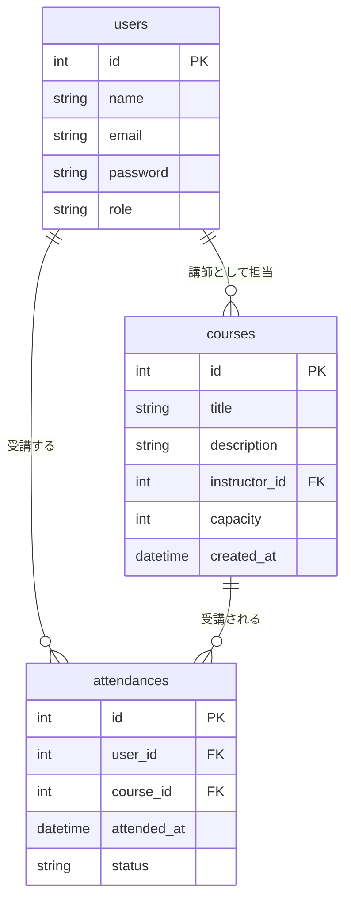

# エンティティ関係図（ER図）

講師（instructor）もUserテーブルの一員です。

### 関係性

| 親エンティティ | 子エンティティ | 関係 | 説明 |
|---------------|----------------|------|------|
| User | Attendance | 1 : N | 1人のユーザーは複数の講座を受講できる |
| Course | Attendance | 1 : N | 1つの講座には複数の受講者がいる |
| User | Course | 1 : N | 1人の講師は複数の講座を担当できる |
