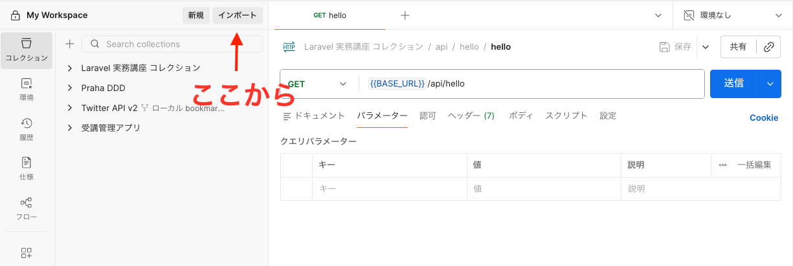
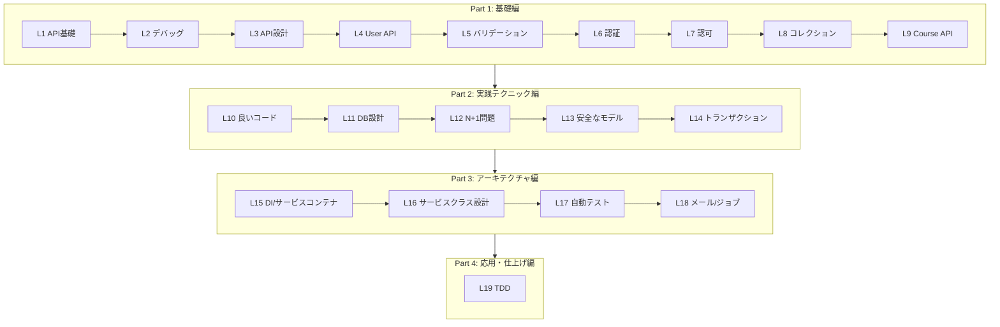

# 受講管理システムを題材としたハンズオン型レッスン

## 概要

- 対象者: Laravel少し経験あり
- 形式: 自習教材（ドキュメント型）
- 構成: 全20レッスン（4パート）
- 技術スタック: Laravel 12 + Inertia.js + React + Fortify

## 題材概要

受講管理システムを段階的に構築しながら、Laravelの実践的なスキルを習得します。

### エンティティ
- User: 生徒/講師を識別する`role`フィールドを持つ
- Course: 講座
- Attendance: 受講（生徒と講座の中間テーブル）

## 事前準備

### Postmanのセットアップ

本レッスンではAPIの動作確認に [Postman](https://www.postman.com/) を使用します。

> 注意: ローカル環境（localhost）へリクエストを送るため、必ず デスクトップアプリ版のPostmanを使用してください。Web版（ブラウザ）ではlocalhostへのアクセスができません。

以下の手順でコレクションをインポートしてください。

1. Postmanを起動する
2. 左上の「Import」ボタンをクリックする
3. `postman/collections/laravel-tutorial.postman_collection.json` をドラッグ＆ドロップ（または「files」から選択）してインポートする

<!-- 画像入れたい -->

## Lesson 0: 環境準備

| # | タイトル | 学習目標 |
|---|---------|---------|
| 0 | [おすすめのVSCode拡張機能](./00-vscode-extensions.md) | Laravel開発に役立つVSCode拡張機能の導入 |

## Part 1: 基礎編 (Lesson 1-9)

| # | タイトル | 学習目標 |
|---|---------|---------|
| 1 | [はじめてのAPI](./01-first-api.md) | api.phpで最初のAPIを作成 |
| 2 | [デバッグ手法を身につける](./02-debugging.md) | Log、Telescope、dd()の使い分け |
| 3 | [API設計の基本](./03-api-design.md) | RESTful API設計原則を学ぶ |
| 4 | [User APIの実装](./04-user-api.md) | Controller、API Resourceの活用 |
| 5 | [バリデーション](./05-validation.md) | FormRequestによる堅牢なバリデーション |
| 6 | [認証の仕組みを理解する](./06-authentication.md) | Fortifyの認証フローを把握 |
| 7 | [認可（Gate/Policy）を実装する](./07-authorization.md) | 「誰が何をできるか」の制御 |
| 8 | [コレクション](./08-collection.md) | コレクションメソッドの活用 |
| 9 | [Course APIの実装](./09-course-api.md) | 講座APIの完成 |

## Part 2: 実践テクニック編 (Lesson 10-14)

| # | タイトル | 学習目標 |
|---|---------|---------|
| 10 | [良いコードを書く](./10-clean-code.md) | 可読性の高いコードの原則 |
| 11 | [データベース設計の基礎](./11-database-design.md) | 堅牢なDB設計の原則 |
| 12 | [N+1問題を解決する](./12-n-plus-one.md) | Eager Loadingの習得 |
| 13 | [安全なモデルの記述](./13-safe-model.md) | Mass Assignment対策 |
| 14 | [トランザクション処理](./14-transaction.md) | データ整合性の担保、排他制御の理解 |

## Part 3: アーキテクチャ編 (Lesson 15-18)

| # | タイトル | 学習目標 |
|---|---------|---------|
| 15 | [サービスコンテナとDI](./15-di-container.md) | 依存性注入の活用 |
| 16 | [サービスクラスの設計](./16-service-class.md) | Fat Controller解消 |
| 17 | [自動テストの書き方](./17-testing.md) | PHPUnit/Pestでテスト |
| 18 | [メールとジョブ機能](./18-mail-job.md) | 非同期処理の基本 |

## Part 4: 応用・仕上げ編 (Lesson 19-20)

| # | タイトル | 学習目標 |
|---|---------|---------|
| 19 | [TDDで機能を追加する](./19-tdd.md) | テスト駆動開発の実践 |

## 各Partで完成するもの

| Part | 完成物 |
|------|--------|
| Part 1 | User API、Course API（CRUD）、認証・認可・バリデーション |
| Part 2 | N+1問題解決、トランザクション処理、安全なモデル |
| Part 3 | サービス層リファクタリング済みAPI、テストコード |
| Part 4 | フロントエンド連携済みの動作する受講管理システム |

## カリキュラム全体マップ

## 補足資料

- [ER図](./er.md)
